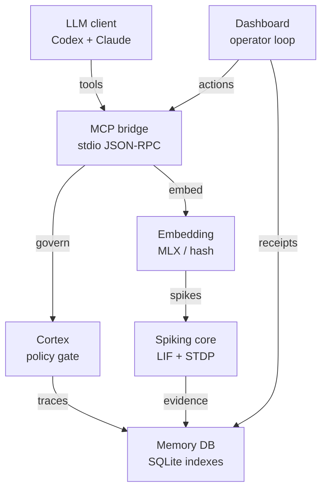
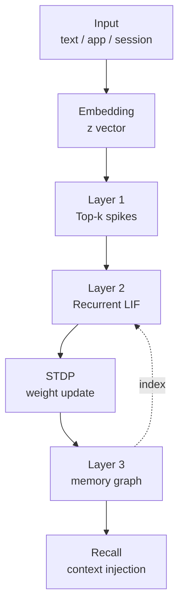

# **SYNAPSE-S2: Spiking STDP Transformer MCP Server**

SYNAPSE-S2 (Synaptic Plasticity & Spiking Encoding via S2) is an Apple Silicon-optimized Model Context Protocol (MCP) server. It provides local large language models (LLMs) with high-efficiency, associative memory capabilities using a persistent, biologically grounded Spiking Neural Network (SNN) substrate.

Traditional transformer self-attention forms a dense token-token score matrix for every layer and attention head, so the attention logits and probabilities scale as `O(N^2)` in sequence length `N`. SYNAPSE-S2 does not materialize that per-request all-pairs attention matrix during recall. It projects local embeddings into sparse spike sets, runs bounded recurrent Leaky Integrate-and-Fire (LIF) dynamics, and stores learned co-activation structure in durable sparse spike, surface-term, relationship, and synaptic indexes. The practical scaling shift is from dense request-time self-attention memory to sparse spike propagation plus indexed local memory lookup. SYNAPSE-S2 still has a configurable topology resource envelope, so the precise claim is that it avoids the transformer attention-matrix memory wall rather than making every internal structure sub-quadratic in every parameter.

### Math Note: What Replaces the `O(N^2)` Attention Wall

In standard scaled dot-product self-attention, an input sequence `X` with shape `N x d` is projected into query, key, and value matrices:

```math
Q = XW_Q,\quad K = XW_K,\quad V = XW_V
```

Each token compares against every other token:

```math
S = \frac{QK^\top}{\sqrt{d_k}},\quad A = \mathrm{softmax}(S),\quad Y = AV
```

Because `S` and `A` are both `N x N`, their memory footprint is `Theta(N^2)` per head before counting values, activations, caches, or batching. Doubling the usable context length roughly quadruples the attention-matrix storage. That is the self-attention memory wall.

SYNAPSE-S2 uses a different runtime object. Text is embedded locally, converted to sparse sensory spikes, and propagated through a recurrent substrate:

```math
z = \mathrm{embed}(\text{text}),\quad s_0 = \mathrm{TopK}(\mathrm{zscore}(z), k)
```

```math
x_t = s_{\text{in}}W_{\text{syn}}\gamma_{\text{syn}} + s_tW_{\text{lat}}\gamma_{\text{lat}}
```

```math
\tilde{u}_{t+1} = \beta u_t + x_t,\quad
s_{t+1} = H(\tilde{u}_{t+1} - V_{\text{thr}}),\quad
u_{t+1} = \tilde{u}_{t+1} - s_{t+1}V_{\text{thr}}
```

Temporal co-activation changes durable relationship strength through STDP:

```math
\Delta W_{\text{lat}} =
A_+e^{-1/\tau_+}s_t s_{t+1}^{\top}
-
A_-e^{-1/\tau_-}s_{t+1}s_t^{\top}
```

```math
W_{\text{lat}} \leftarrow \mathrm{clip}(W_{\text{lat}} + \Delta W_{\text{lat}}, -c, c)
```

At inference time, active spike operations are dominated by additions, threshold comparisons, decay, and sparse/indexed retrieval rather than dense query-key matrix multiplication over all token pairs. The implementation still uses MLX arrays and scalar multiplications for decay, weighting, and setup where appropriate; "multiplication-free" should be read as the neuromorphic recall path avoiding dense per-token dot-product attention, not as a claim that no numeric multiplication exists anywhere in the codebase. The STDP equation above is the implemented one-step discrete update: previous spikes potentiate current spikes, current spikes depress the reverse direction, and lateral weights are clipped to a configured envelope.

## **Operational Quickstart**

This repository now includes a working local MCP server, a SQLite-backed persistent memory store, runtime toggle controls, and a CLI for validation outside an MCP client.
Text recall is routed through a pluggable local embedding provider. The default client/launcher path is `mlx-neural-v1`, backed by the local MLX model `mlx-community/Qwen3-Embedding-0.6B-4bit-DWQ`; it runs on Apple Silicon through `mlx-lm`, stores weights under `.synapse_s2/models`, and emits provider provenance on every text memory. `semantic-hash-v1` remains available as the deterministic offline fallback, `lexical-hash-v1` is available for strict legacy behavior, and `python:/path/to/module.py:function` can point SYNAPSE-S2 at an IT-managed local encoder.

### 1. Install Runtime Dependencies

```bash
brew install uv
uv sync
scripts/install_local_launcher.sh
scripts/install_client_configs.py
scripts/install_capture_daemon.sh
```

The launcher installs `/Users/dan.driver/.local/bin/synapse-s2-mcp`. It exists because this checked-out workspace path contains spaces and a colon, which can break tools that split command strings or PATH entries. The launcher executes the synced virtual environment directly:

```bash
/Users/dan.driver/.local/bin/synapse-s2-mcp
```

The launcher enters through `mcp_client_wrapper.py`, which hydrates recall and graph state at MCP process startup without claiming or acknowledging context-bus events that the host has not seen, enters a strict Cortex Governor session for that client, and drops a sanitized session-boundary note into `.synapse_s2/capture_inbox` when the client disconnects. The same exit path also commits a typed `follow_up` cortical trace so the client lifecycle is visible in governed memory, not only the inbox. `scripts/install_client_configs.py` stamps distinct delivery identities for Codex, Claude Desktop, Claude Code, and the project `.mcp.json` manifest so one client cannot consume another client's exact-target deployments.

### 2. Verify the Local Engine

```bash
.venv/bin/python -m unittest discover -s tests -v
.venv/bin/python synapse_cli.py --json doctor --context default
.venv/bin/python synapse_cli.py --json \
  --embedding-provider mlx-neural \
  provider-benchmark \
  --text "SYNAPSE-S2 neural embedding benchmark" \
  --runs 3
.venv/bin/python synapse_cli.py --json certify-runtime \
  --strict-native \
  --benchmark-quick-prune \
  --require-resource-envelope
```

For the Monday operator-trust certification path, run:

```bash
.venv/bin/python scripts/operator_readiness_certify.py \
  --context default \
  --agent-id codex-desktop \
  --embedding-provider mlx-neural
```

This writes a single evidence pack under `.synapse_s2/evidence_packs/` proving client config, MCP launcher connection, the installed compact MCP contract and its two independently bounded output channels, native MLX neural embeddings, Doctor, Start Work, real memory write and recall, App Connect no-write preview, Wrap Session persistence, and dashboard render smoke. The command exits non-zero unless every required proof is ready.

For the full install/prep path, run:

```bash
scripts/prep_tomorrow.sh
```

For a no-install/no-ingest audit pass first:

```bash
scripts/prep_tomorrow.sh --verify-only
```

The detailed operator runbook is in `docs/TOMORROW_RUNBOOK.md`.
The single-pack readiness certification runbook is in `docs/OPERATOR_READINESS_CERTIFICATION.md`.
The strict proposal coverage matrix is in `docs/PROPOSAL_COMPLIANCE.md`.
The production gap audit is in `docs/PRODUCTION_GAP_AUDIT.md`.
The point-in-time live status report is in `docs/CURRENT_STATUS.md`.
The durable idempotency, crash-recovery, and rollout contract for capture
producers is in `docs/EXACTLY_ONCE_CAPTURE.md`.
The bounded installed-client response profiles, receipt-safety invariants, and
the reproducible measurement acceptance gate are in `docs/TOKEN_CONTRACTS.md`.
The sanitized Phase 6 acceptance artifact is
`docs/evidence/phase6-token-contract-acceptance.json`: it passed all 11
correctness gates against a verified isolated recovery restore, with an
informational 96.818% installed-policy byte reduction and 78.03% same-source
projection reduction. Those two measurements are deliberately separate and do
not replace the correctness gates.
Regenerate `docs/CURRENT_STATUS.md` before demos, handoffs, or readiness claims:

```bash
.venv/bin/python scripts/synapse_status_report.py \
  --context default \
  --agent-id codex-desktop \
  --embedding-provider mlx-neural
```

### Daily Operator Trust Loop

The loopback dashboard now has a single operator workflow for first-use and handoff confidence: the saved memory namespace selector, Start Work, Context Health, Doctor/Repair, Memory Hygiene, Goal Ledger, App Preview receipts, Recall Pin, Recipes, and Wrap Session. The same loop is available from the CLI:

```bash
.venv/bin/python synapse_cli.py --json start-work \
  --context default \
  --agent-id codex-desktop \
  --prompt "Prepare SYNAPSE-S2 for today's operator work."
# start-work is observation-only. To claim durable deployments for use:
.venv/bin/python synapse_cli.py --json agent-brief \
  --mode morning \
  --context default \
  --agent-id codex-desktop \
  --prompt "Prepare SYNAPSE-S2 for today's operator work." \
  --response-mode compact \
  --max-response-bytes 12288
# After consuming every rendered deployment, ACK its exact receipt (repeat as needed):
.venv/bin/python synapse_cli.py --json ack-context \
  --context default \
  --agent-id codex-desktop \
  --receipt-id '<receipt_id from agent-brief>'
.venv/bin/python synapse_cli.py --json goal.create \
  --context default \
  --agent-id codex-desktop \
  --title "Prepare SYNAPSE-S2 for Monday operator use" \
  --owner operator \
  --goal-state in_progress \
  --next-action "Run Start Work, Doctor, App Preview, Recall Pin, and Wrap Session."
.venv/bin/python synapse_cli.py --json goal.list --context default
.venv/bin/python synapse_cli.py --json context-health --context default
.venv/bin/python synapse_cli.py --json memory-hygiene --context default --limit 25
.venv/bin/python synapse_cli.py --json doctor --context default --include-apps --repair-plan
.venv/bin/python synapse_cli.py --json wrap-session \
  --context default \
  --agent-id codex-desktop \
  --source-tag codex-session \
  --text "Session decisions, validation evidence, and follow-up constraints." \
  --preview
```

Use `wrap-session --confirm` only after the preview receipt matches the facts you intend to preserve.

### Hardened Local Operating Contract

- Dashboard HTTP is a strictly loopback-only operator API. Non-loopback binds are refused; use an authenticated, separately reviewed gateway if remote access is ever required.
- Capture inbox drops are redacted before they are written to disk; inbox, processed, error, backup, export, and SQLite files are kept private to the local user where the filesystem permits it.
- Redaction is recursive across nested metadata and response payloads. Credential-shaped CLI/API identifiers are rejected without reflection, raw-content digest fields are removed before persistence, and public errors expose only sanitized categories.
- Capture processing rejects symlink payloads and over-large payloads instead of following arbitrary files.
- Capture commits are exactly-once by `capture_id`: the memory/event/relationship write and capture-operation ledger commit in one transaction, while durable receipt files make post-commit cleanup crash-recoverable.
- Terminal discard evidence and sanitized historical capture errors remain visible until an operator reviews a content-free preflight and confirms archival. Use `capture-error-preflight` and `capture-error-resolve --confirm`; unsafe or raw-retaining artifacts are never auto-archived.
- Direct conversation capture, context-bus deployments, graph metadata, and returned API/MCP payloads use the same redaction path, so sanitized storage does not mask a raw response leak.
- Versioned startup hygiene re-runs stronger detection rules against legacy durable content. Secret-derived memory nodes and their retrieval artifacts are pruned; repairable event/metadata fields are transactionally sanitized; only count-only maintenance receipts are retained.
- MCP memory and Cortex pruning require explicit `confirm=true`; CLI memory and Cortex pruning require `--confirm`; the dashboard requires a confirmation control before destructive graph operations and governed-trace deletion.
- `test-validated` Cortex traces require concrete validation evidence such as a test command, test list, output summary, artifact path, commit, or verification report. Dashboard typed-memory defaults stay at `observed` evidence.
- Spike recall and surface-text recall both use durable SQLite indexes (`memory_spikes` and `memory_surface_terms`) maintained on every memory write, so recall does not need to scan the full memory table as the graph grows.
- Client config installation refuses malformed existing JSON instead of silently overwriting it.
- Existing client configs receive private, exclusive, collision-proof backups before atomic replacement. The local MCP bridge starts in a compact control-plane mode and defers dense neural state until a neural tool is actually requested.
- Installed MCP clients default to the versioned `compact` response profile with an exact 12,288-byte post-redaction UTF-8 ceiling for authoritative `structuredContent` on memory lists, memory graphs, agent hydration, and Cortex state. MCP emits one separate safety `TextContent` item bounded to 4,096 bytes in compact mode; full-mode safety text is separately bounded to 131,072 bytes. Outer JSON-RPC framing is excluded. Each envelope reports provenance, completeness, pagination support, serialized bytes, and counted omissions; `response_mode="full"` is an explicit bounded diagnostic escape hatch.
- CLI `agent-brief`, `list-memory`, `graph`, and `cortex-state` use the same compact contract by default. They accept `--response-mode full --max-response-bytes <4096..131072>` for bounded diagnostics and `--response-mode legacy` only for known local compatibility consumers.
- Compact projection never drops a leased receipt or its matching visible event. If a hydration projection cannot be delivered safely, its leases are released and acknowledgement remains a separate exact-receipt operation.
- Critical/high, action-required, and protected contract warnings survive compact projection. Noncritical warnings may be omitted only as complete items with a truthful omission count. MCP consumers must treat `structuredContent` as authoritative; the bounded text item is only a safety decision aid.
- The reproducible Phase 6 acceptance artifact passed all 11 gates on all four contracted surfaces. It records 1,200,724 legacy installed-policy bytes versus 38,205 compact structured bytes (96.818% reduction), and 106,735 identical-source legacy bytes versus 23,450 compact structured bytes (78.03% reduction). These are informational byte measurements from a verified isolated restore; token counts and transport framing are excluded.
- The loopback dashboard keeps its rich browser API and Namespace Galaxy payloads; the installed MCP token ceiling does not reduce the operator visualization.
- LaunchAgent installers fence concurrent installs, publish private/fsynced plists, wait for launchd unload/start transitions, probe the authoritative service, and restore the prior definition and policy when a health gate fails.

### 3. Write and Query Persistent Memory

```bash
.venv/bin/python synapse_cli.py --json remember-text \
  --context default \
  --tag production-memory-contract \
  --text "SYNAPSE-S2 stores durable local memory in the shared .synapse_s2 SQLite substrate. Codex, Claude Desktop, Claude Code, the CLI, the dashboard, and direct FastMCP launches use the same local launcher and memory database."
.venv/bin/python synapse_cli.py --json ingest-text \
  --context default \
  --tag production-preflight-brief \
  --text "The SYNAPSE-S2 backend imports mlx.core and mlxsnn on Apple Silicon. The recurrent LIF backend uses z-score top-k spike coding, immutable MLX state updates, STDP relationship updates, quick-pruning maintenance, and deep-sleep consolidation. The context bus stores durable deployment events that connected local clients pull with fenced receipts, acknowledge exactly after consumption, and track through derived delivery cursors." \
  --surprise-threshold 0.58 \
  --min-segment-sentences 1
.venv/bin/python synapse_cli.py --json query-text \
  --context default \
  --text "Which clients share the SYNAPSE-S2 memory database and launcher?"
.venv/bin/python synapse_cli.py --json graph --context default --limit 10 \
  --response-mode compact --max-response-bytes 12288
```

Expected query output returns ranked registered traces such as `production-memory-contract` and linked event traces from `production-preflight-brief`.
Event ingestion additionally creates segmented memories such as `production-preflight-brief-event-001` and relationship edges such as `temporal_next` and `semantic_overlap`. Event boundaries are driven by the configured local embedding provider's cosine-distance surprise when available, while retaining lexical surprise as an auditable fallback.

Real memory is stored locally in `.synapse_s2/memory.sqlite3`. Runtime toggles and client state live in `.synapse_s2/runtime_state.json`. Both `.mcp.json` and `/Users/dan.driver/.codex/config.toml` set `SYNAPSE_S2_MEMORY_DB` so Codex, Claude, and direct CLI runs target the same durable substrate. MCP export and backup paths are constrained to `.synapse_s2` by default through `SYNAPSE_S2_EXPORT_DIR`; the CLI remains available for explicit operator-chosen local paths.
Each text memory stores `metadata.embedding_provider` provenance including provider id, provider type, model id, local-only status, semantic flag, dimensions, vector hash, and neural runtime fields when applicable (`native_mlx`, `pooling`, `source_dimensions`). Set `--embedding-provider semantic-hash` for the deterministic no-model fallback, `--embedding-provider lexical-hash` for exact legacy behavior, or `--embedding-provider python:/absolute/path/encoder.py:embed` to use a local callable that returns a vector or `{ "vector": [...], "model_id": "...", "semantic": true }`.
Each event memory also stores `metadata.surprise_model`, `metadata.surprise_mode`, `metadata.semantic_surprise_score`, and `metadata.lexical_surprise_score`, so operators can tell whether a boundary was cut by semantic embedding distance or by lexical fallback.
SQLite maintains a durable sparse spike index and a durable surface-term index for prompt recall. The surface index is built from tags, display labels, display summaries, semantic facets, detail badges, keywords, and bounded source text, and existing memory databases are backfilled automatically on startup.
Compound entry/index/event writes use explicit SQLite transactions with `FULL` synchronous durability by default. Set `SYNAPSE_S2_SQLITE_DURABILITY=balanced` only when measured throughput is more important than retaining the latest committed transaction through sudden power loss.

Inspect and export the memory store:

```bash
.venv/bin/python synapse_cli.py --json list-memory --context default --limit 20 \
  --response-mode compact --max-response-bytes 12288
.venv/bin/python synapse_cli.py --json export-memory \
  --context default \
  --output .synapse_s2/default-memory-export.json
```

Exports publish through a private same-directory temporary file and atomic
rename. Paired recovery points are integrity-checked, fsynced, Ed25519-signed,
and published without overwriting existing paths. They bind SQLite to the
exactly-once capture transport and expose signed replay reconciliation plus a
separate `cutover_ready` decision. Verification re-canonicalizes every archived
processed v2 request against the snapshot ledger and returns a content-free
`capture_ledger_binding` count/revision proof; an isolated restore derives the
same proof again from the restored files and database. `backup-memory` is retained as a segregated
database-only diagnostic; it is not sufficient for recovery.

Before creating a paired recovery point, prove that every processed
`capture.v2` record is bound to the authoritative SQLite capture ledger:

```bash
.venv/bin/python synapse_cli.py --json capture-ledger-integrity \
  --capture-root .synapse_s2
```

`status: "ready"`, `verification_passed: true`, and zero missing, blocked, or
mismatched records are required. A paired backup runs this authority gate again
before publishing any bundle artifacts. If a read-only audit reports a bounded
historical cutover cohort as `repairable`, review its finding samples and retain
the exact `audit_revision`, then make the separate confirmed repair and re-audit:

```bash
.venv/bin/python synapse_cli.py --json capture-ledger-integrity \
  --capture-root .synapse_s2 \
  --repair --confirm \
  --expected-revision '<audit_revision>'
.venv/bin/python synapse_cli.py --json capture-ledger-integrity \
  --capture-root .synapse_s2
```

After the fresh audit is ready, create the complete recovery point:

```bash
.venv/bin/python synapse_cli.py --json backup-recovery \
  --output ".synapse_s2/backups/verified/default-recovery-$(date +%Y%m%d-%H%M%S).sqlite3" \
  --capture-root .synapse_s2 \
  --purpose operator \
  --pinned
```

This governed legacy reconciliation does not replay a processed capture, create
memory/relationship/deployment graph effects, or synthesize a capture transport
receipt or context-delivery acknowledgement. It projects the canonical request
fingerprint from the surviving redacted processed payload and uses the already
durable conversation-capture deployment timestamp as the historical commit
time. Only the missing compact ledger rows and one content-free maintenance
receipt are written, after a verified safety backup. Stale revisions, modern-v2
ledger loss, ambiguous deployment ownership, changed evidence, or incomplete
graph bindings fail closed and require evidence repair or a verified restore.
`cutover_ready: true` additionally requires a verified capture-ledger binding
proof; matching capture IDs or reconciliation counts alone are not sufficient.

Retention is a signed two-step contract. Planning is read-only and binds the
exact identity of every protected and retiring artifact; applying requires the
same policy, the unexpired plan token, and explicit confirmation. Apply moves
whole verified bundles by atomic rename into a private same-filesystem
quarantine. It never deletes them, and the matching restore command is
idempotent:

```bash
.venv/bin/python synapse_cli.py --json recovery-retention-plan \
  --keep-latest 7 --max-age-days 30
.venv/bin/python synapse_cli.py --json recovery-retention-apply \
  --plan-token "<plan_token>" \
  --cutoff-created-at "<cutoff_created_at>" \
  --keep-latest 7 --max-age-days 30 --confirm
.venv/bin/python synapse_cli.py --json recovery-retention-restore \
  --plan-token "<plan_token>" --confirm
```

Quarantine is deliberately reversible and does not reclaim disk space. There is
no purge command. Restore proof is isolated and never overwrites the live store;
a live cutover must be performed later through a separately quiesced,
authoritative service workflow.

Audit derived recall indexes before relying on Doctor or after any interrupted,
disk-full, or legacy write. Audit mode opens the existing database read-only,
does not apply schema migrations, and returns a content-bound `audit_revision`:

```bash
.venv/bin/python synapse_cli.py --json memory-integrity --context default
```

If the report is `degraded` and `repairable` is true, review its mismatch
samples and pass that exact revision into the confirmed repair:

```bash
.venv/bin/python synapse_cli.py --json memory-integrity \
  --context default \
  --repair \
  --confirm \
  --expected-revision '<audit_revision>'
```

Repair refuses stale plans and malformed canonical source data. Before changing
an index it drains cooperating dashboard, capture, MCP, and CLI writers; verifies
enough free-space headroom; creates a private, SHA-256 recorded SQLite safety
snapshot; and verifies `quick_check` and foreign keys. It then repairs only
affected rows (including missing derived-index schema) in one bounded writer
transaction, bumps the durable semantic-index generation so every process cache
invalidates, writes a target-digested maintenance receipt, and performs a full
post-repair audit. If planning, backup, or commit fails, the transaction rolls
back and the unused attempt backup is removed.

Dashboard Doctor audits all namespaces, not only the active selector. The full
scan refreshes in a background worker and Doctor returns a bounded pending or
age-stamped cached state so the single-thread MLX request loop stays responsive;
the CLI Doctor waits for a current authoritative audit.

Connected MCP processes hydrate recall and graph state on startup, but deliberately leave context events unclaimed until an agent-facing pull or hydrate response can carry the receipt. To lease the current FIFO briefing manually:

```bash
.venv/bin/python synapse_cli.py --json agent-brief \
  --context default \
  --agent-id codex-desktop \
  --prompt "Summarize the current SYNAPSE-S2 work and next implementation gap." \
  --response-mode compact \
  --max-response-bytes 12288
```

`agent-brief` composes a leased FIFO event batch, text recall, and graph summary into one agent-ready briefing. It never acknowledges before stdout or transport delivery: after the briefing is successfully consumed, acknowledge each returned `receipt_id`. `agent-brief --mode morning` returns the operator Start Work structure; the dashboard acknowledges its receipts only after rendering succeeds. Delivery is target-isolated and at-least-once, with a stable `delivery_id` for consumer deduplication and a new fenced receipt on each expired retry. Use the lower-level commands when diagnosing delivery state directly:

The CLI command above and installed MCP `hydrate_spiking_agent_context` calls
return `synapse-s2.token-contract.v1` in `compact` mode by default. Compact
hydration preserves one visible deployment for every leased receipt and reports
`ack_required`, `has_more`, retry/dead-letter blockers, provenance, and any
projection omissions. MCP callers can pass `response_mode="full"` and
`max_response_bytes`; CLI callers use `--response-mode full` and
`--max-response-bytes`. CLI `--response-mode legacy` exists only for known local
compatibility consumers. See `docs/TOKEN_CONTRACTS.md` for the exact contract.

```bash
.venv/bin/python synapse_cli.py --json observe-context --context default --since-event-id 0 --order asc --limit 10
.venv/bin/python synapse_cli.py --json pull-context --context default --agent-id codex-desktop --consumer-instance-id terminal-review --limit 10
.venv/bin/python synapse_cli.py --json ack-context --context default --agent-id codex-desktop --receipt-id '<receipt_id>'
.venv/bin/python synapse_cli.py --json release-context --context default --agent-id codex-desktop --consumer-instance-id terminal-review --receipt-id '<receipt_id>'
.venv/bin/python synapse_cli.py --json list-context-cursors --context default
```

The raw `observe-context` ledger is read-only and FIFO by default. It cannot create a receipt or advance a cursor. Legacy high-watermark acknowledgements are rejected; only an opaque receipt belonging to the configured context and agent can advance the receipt-verified contiguous cursor. Existing pre-v2 cursor rows remain explicitly unverified and are not imported as proof of consumption, so retained events replay safely instead of preserving a potentially skipped backlog.

Run a governed agent session when you want SYNAPSE-S2 to act as a live cognitive control plane instead of passive recall only:

```bash
SESSION_ID=$(.venv/bin/python synapse_cli.py --json enter-cortex \
  --context default \
  --agent-id codex-desktop \
  --task "Implement the next SYNAPSE-S2 change with verification before mutation." \
  --mode strict | .venv/bin/python -c 'import json,sys; print(json.load(sys.stdin)["session_id"])')
.venv/bin/python synapse_cli.py --json cortex-tick \
  --context default \
  --agent-id codex-desktop \
  --session-id "$SESSION_ID" \
  --observation "About to edit backend and dashboard files." \
  --proposed-action "Patch code, run focused tests, then run full validation." \
  --intended-file mlx_backend.py \
  --intended-file web/app.js \
  --intended-tool "python -m unittest discover -s tests -v" \
  --mutation-intent \
  --confidence 0.62
.venv/bin/python synapse_cli.py --json commit-cortex \
  --context default \
  --agent-id codex-desktop \
  --session-id "$SESSION_ID" \
  --type validation \
  --truth-posture test-validated \
  --text "Focused and full validation passed for the governed change." \
  --evidence '{"tests":["unittest discover"],"surface":"cli"}'
.venv/bin/python synapse_cli.py --json close-cortex \
  --context default \
  --agent-id codex-desktop \
  --session-id "$SESSION_ID" \
  --reason "validated-and-wrapped"
.venv/bin/python synapse_cli.py --json cortex-state --context default \
  --agent-id codex-desktop \
  --response-mode compact --max-response-bytes 12288
```

The Cortex Governor state is also included in `agent-brief`, MCP hydration, and the dashboard snapshot. It is intentionally typed: `goal`, `objective`, `decision`, `constraint`, `implementation`, `validation`, `risk`, `correction`, and `follow_up` traces carry truth posture, confidence, evidence, agent id, and session id. Each governor tick can also declare intended files and tools; SYNAPSE-S2 persists that scope, warns on undeclared mutations, sensitive paths, and high-impact tool use, and surfaces active goals, assumptions, contradictions, suggested next move, and capture queue in Cortex state. Use `goal.create`, `goal.update`, and `goal.list` to track lightweight operational goals with owner, state, evidence, and next action; MCP clients use `create_spiking_goal`, `update_spiking_goal`, and `list_spiking_goals` for the same ledger. Close the session after verified traces or Wrap Session handoff are captured so the dashboard returns to an explicit idle state instead of leaving stale active sessions. Runtime state persistence now merges cross-process Cortex session closures, so a long-running dashboard or capture daemon cannot resurrect a session that a fresh CLI/MCP process already closed.

Capture real operator/Codex conversation notes into the event graph:

```bash
.venv/bin/python synapse_cli.py --json capture-session \
  --context default \
  --tag codex-session \
  --speaker codex \
  --text "User asked for future conversation details to appear in the event relationship graph. Codex added durable session capture plus surgical memory pruning. Operators can remove sensitive, wrong, or partial-truth graph data by node, edge, deployment event, or relationship mode."
```

Conversation capture automatically builds a local context namespace for the active topic or feature. Prefixes such as `Thread:`, `Feature:`, `Topic:`, `Goal:`, `Objective:`, and `Event:` become typed graph nodes, while the original conversation events receive the same `context_namespace` metadata and are linked back to the namespace anchor with `namespace_contains` edges. This is what makes new topics, current features, objectives, and temporal session details visibly grow in the relationship visualizer.

For the always-on "magic" capture lane, run the launchd sidecar and drop session payloads into the local inbox. This is still opt-in and local: clients, hooks, or operators write a payload, then the sidecar redacts common secret shapes and ingests it into the same real graph used by MCP, CLI, and the dashboard.

```bash
scripts/install_capture_daemon.sh
.venv/bin/python synapse_cli.py --json capture-inbox-drop \
  --context default \
  --tag codex-session \
  --speaker codex \
  --text "Capture a concise factual session note here."
.venv/bin/python synapse_cli.py --json capture-inbox-status
.venv/bin/python synapse_cli.py --json capture-inbox-process --confirm
.venv/bin/python synapse_cli.py --json graph --context default --limit 30 \
  --response-mode compact --max-response-bytes 12288
```

Manual inbox processing is confirmation-gated. The launchd sidecar can process its own local queue continuously, but CLI and MCP one-shot processing require `--confirm` / `confirm=true`, and the dashboard Magic Capture button performs a preflight with a short-lived confirmation token before committing pending files.

Every new producer should use capture protocol `capture.v2`: create one
`s2cap_<32 lowercase hex>` ID before its first attempt and reuse that ID only
when retrying the exact same redacted request. The SQLite capture ledger is the
source of truth; filenames, paths, timestamps, and raw-input hashes are never
capture identity. See `docs/EXACTLY_ONCE_CAPTURE.md` before deploying or rolling
back capture producers and the sidecar.

App Connect gives operators a local attach path for already-running apps. It detects attachable local apps through a fast filtered process-list scan, records a confirmed attachment, and can capture either intentionally selected text or a redacted Accessibility snapshot into the same temporal event graph and context bus. Dashboard app attach and snapshot actions use preflight confirmation tokens bound to the selected app/connection so a stale click cannot silently retarget capture. This is a hardened local connector, not a remote control plane.

```bash
.venv/bin/python synapse_cli.py --json app-list
.venv/bin/python synapse_cli.py --json app-connect \
  --context default \
  --app-name "Google Chrome" \
  --tag chrome-live \
  --speaker operator \
  --confirm
.venv/bin/python synapse_cli.py --json app-connections
.venv/bin/python synapse_cli.py --json app-snapshot-preview \
  --connection-id "<connection-id-from-app-connections>"
.venv/bin/python synapse_cli.py --json app-snapshot \
  --connection-id "<connection-id-from-app-connections>" \
  --confirm
scripts/capture_frontmost_selection.sh default frontmost-selection operator
```

Preview before snapshot is the trust step: it reports a quality badge, signal character count, line count, redaction count, and recommended next action without writing memory. If the badge is blocked or low-signal, select the relevant visible text in that app and run the frontmost-selection helper. The helper copies the selection once, calls `capture-clipboard`, restores the prior clipboard, and exits.

Local transcript files can also be registered as bounded delta sources for clients or tools that write their own logs:

```bash
.venv/bin/python synapse_cli.py --json transcript-source-add \
  --context default \
  --source-id codex-live \
  --path /path/to/session.log \
  --tag codex-live \
  --speaker codex \
  --confirm
.venv/bin/python synapse_cli.py --json transcript-source-poll --source-id codex-live
```

Hand-prune bad or sensitive memory from the same durable store:

```bash
.venv/bin/python synapse_cli.py --json graph --context default --limit 30 \
  --response-mode compact --max-response-bytes 12288
.venv/bin/python synapse_cli.py --json prune-memory \
  --context default \
  --target-type event \
  --memory-id "<memory-id-from-graph>" \
  --reason "remove sensitive or partial-truth event" \
  --confirm
.venv/bin/python synapse_cli.py --json prune-memory \
  --context default \
  --target-type relationship \
  --relationship-id "<relationship-id-from-graph>" \
  --reason "remove bad edge" \
  --confirm
```

Supported prune targets are `event`, `memory`, `relationship`, `context_event`, `temporal`, and `associative`. Mode-wide `temporal` and `associative` pruning removes all matching edges in the selected context, so prefer a single node or relationship ID when possible.

### 4. Toggle Runtime Behavior

```bash
.venv/bin/python synapse_cli.py --json disable --context default
.venv/bin/python synapse_cli.py --json query-text --context default --text "anything"
.venv/bin/python synapse_cli.py --json enable --context default
```

When disabled, queries return a disabled status instead of mutating or recalling memory.

### 5. MCP Tool Surface

The MCP server exposes these tools:

| Tool | Purpose |
| :--- | :--- |
| `query_spiking_attention` | Query with a dense embedding vector. |
| `query_spiking_attention_text` | Query text through the configured local embedding provider, defaulting to MLX neural embeddings in installed clients. |
| `remember_spiking_context` | Persist a named context trace from text and/or an embedding. |
| `set_spiking_attention_enabled` | Enable or disable SYNAPSE-S2 globally or per context id. |
| `get_spiking_attention_status` | Report health, dependency state, memory counts, and toggle state. |
| `list_spiking_memory` | List persisted SQLite memory through the compact contract by default; `full` is explicit and compact mode rejects vector/index arrays. |
| `ingest_spiking_memory_text` | Segment long text into event memories and persist graph relationships. |
| `capture_spiking_conversation` | Capture real operator/agent conversation notes as temporal event memories. |
| `drop_spiking_capture_inbox` | Drop opt-in session text into the local capture inbox sidecar. |
| `get_spiking_capture_inbox_status` | Show pending, processed, and failed inbox file counts. |
| `process_spiking_capture_inbox` | Process pending inbox drops into the real memory graph; requires `confirm=true`. |
| `register_spiking_transcript_source` | Register a confirmed local transcript/log file for bounded delta capture. |
| `list_spiking_transcript_sources` | List registered local transcript sources. |
| `poll_spiking_transcript_sources` | Poll registered transcript deltas into temporal event memory. |
| `capture_spiking_clipboard` | Capture intentionally selected/copied text as a one-shot redacted memory payload. |
| `list_spiking_running_apps` | Detect locally visible foreground apps for App Connect. |
| `connect_spiking_app` | Attach a confirmed local app connection for snapshot/selection capture. |
| `list_spiking_app_connections` | List App Connect attachments. |
| `capture_spiking_app_snapshot` | Capture a confirmed redacted local app Accessibility snapshot into memory. |
| `list_spiking_memory_graph` | List compact memory nodes and relationship edges with endpoint resolution, provenance, completeness, and omission metadata. |
| `prune_spiking_memory` | Remove one memory node, relationship edge, context deployment event, or relationship mode. |
| `pull_spiking_context_deployments` | Pull durable context-bus events published by GUI and MCP write actions. |
| `ack_spiking_context_deployments` | Atomically acknowledge exact receipt ids after their deployments were consumed. |
| `dead_letter_spiking_context_delivery` | Quarantine a retry-exhausted delivery with a reason, explicit confirmation, and durable governance audit. |
| `list_spiking_context_cursors` | List per-agent delivery cursors and pending deployment counts. |
| `hydrate_spiking_agent_context` | Lease a bounded agent-ready contract with one visible event per receipt, prompt recall, and graph highlights; acknowledge returned receipts separately after use. |
| `enter_spiking_cortex` | Start a governed agent session with policy, recall, and a context-bus deployment. |
| `tick_spiking_cortex` | Evaluate the current observation, proposed action, intended files, and intended tools against governed memory before proceeding. |
| `close_spiking_cortex` | End an active governed session after validation or handoff and publish a `cortex-closed` lifecycle event. |
| `commit_spiking_cortical_trace` | Persist a typed governed trace with truth posture, confidence, and evidence. |
| `moderate_spiking_cortical_trace` | Promote, demote, or prune a governed trace from MCP clients by memory id. |
| `get_spiking_cortex_state` | Inspect active governed sessions and typed cortical memory through the compact contract by default. |
| `create_spiking_goal` | Create an auditable goal-ledger trace with owner, state, evidence, and next action. |
| `update_spiking_goal` | Append a state update to an existing goal-ledger trace. |
| `list_spiking_goals` | List current goal-ledger state for a context. |
| `benchmark_spiking_embedding_provider` | Benchmark the configured local embedding provider and return latency plus provenance. |
| `profile_spiking_resources` | Report actual topology array memory estimates and optional quick-pruning timing. |
| `certify_spiking_runtime` | Emit native runtime certification evidence for MLX, mlxsnn, envelope, provider, and quick-prune checks. |
| `export_spiking_memory` | Export persisted memory entries as JSON, optionally to a local file. |
| `backup_spiking_memory` | Create a segregated SQLite-only diagnostic snapshot. |
| `audit_capture_ledger_integrity` | Read-only audit of processed capture.v2 evidence against authoritative SQLite ledger bindings. |
| `repair_capture_ledger_integrity` | Apply a reviewed, revision-bound legacy ledger reconciliation without replaying graph effects or synthesizing transport receipts. |
| `backup_spiking_recovery` | Create and immediately verify a signed paired database plus capture recovery point. |
| `verify_spiking_recovery` | Reverify all four bound recovery artifacts and signed replay reconciliation. |
| `restore_spiking_recovery_proof` | Materialize an isolated paired restore proof without touching live state. |
| `plan_spiking_recovery_retention` | Produce and persist a signed, expiring, exact-inventory retention plan. |
| `apply_spiking_recovery_retention` | Atomically quarantine only the exact planned stale bundles; requires confirmation. |
| `restore_retired_spiking_recovery` | Reversibly restore quarantined bundle sets and reverify them; requires confirmation. |
| `trigger_sleep_consolidation` | Run deep-sleep consolidation and semantic hierarchy extraction. |
| `trigger_idle_maintenance` | Run due maintenance or force idle deep-sleep consolidation. |

FastMCP smoke check:

```bash
.venv/bin/fastmcp list --command /Users/dan.driver/.local/bin/synapse-s2-mcp --json --timeout 15
.venv/bin/fastmcp call --command /Users/dan.driver/.local/bin/synapse-s2-mcp \
  --target get_spiking_attention_status \
  --input-json '{"context_id":"default"}' \
  --json --timeout 15
```

Project `.mcp.json`, `/Users/dan.driver/.codex/config.toml`, Claude Desktop, and Claude Code can be refreshed with:

```bash
scripts/install_client_configs.py
```

The installer preserves existing client settings, writes timestamped backups before mutating existing JSON/TOML files, and points every client at `/Users/dan.driver/.local/bin/synapse-s2-mcp` plus the shared `.synapse_s2` state directory. It also assigns per-client `SYNAPSE_S2_CLIENT_AGENT_ID` values: `codex-desktop`, `claude-desktop`, `claude-code`, and `project-mcp`, and stamps `SYNAPSE_S2_CLIENT_CORTEX=1` with `SYNAPSE_S2_CLIENT_CORTEX_MODE=strict`. Restart Codex, Claude Desktop, and Claude Code after running it so each client reloads its MCP server registry and starts using the startup/Cortex/session-boundary bridge.

### 6. Maintenance Lifecycle

Quick-pruning is configured for the proposal's five-minute interval (`300` seconds) and automatically runs from the live query/register path when due. It is also available as an explicit operator command:

```bash
.venv/bin/python synapse_cli.py --json quick-prune
```

Resource profiling reports the MLX topology footprint from the live arrays (`W_syn`, `W_lateral`, membrane state, spike state, and active traces). With the default 1,024 x 8,192 topology it is expected to land near 288 MB, inside the Mac-optimized 96-384 MB operating envelope while materially increasing the recurrent substrate above the original 5,000-neuron prototype; tiny test topologies correctly report a smaller footprint.

```bash
.venv/bin/python synapse_cli.py --json profile --benchmark-quick-prune
.venv/bin/python synapse_cli.py --json preflight --require-resource-envelope
.venv/bin/python synapse_cli.py --json certify-runtime \
  --strict-native \
  --benchmark-quick-prune \
  --require-resource-envelope \
  --output .synapse_s2/native-certification.json
```

Idle deep-sleep consolidation is available from MCP and CLI:

```bash
.venv/bin/python synapse_cli.py --json idle-maintenance --force-deep-sleep
.venv/bin/python synapse_cli.py --json sleep
```

Deep sleep returns all seven proposal lifecycle phases: connection weight decay, synaptic clustering, semantic merging, threshold rescoring, trace promotion, relationship extraction, and neurogenesis.

### 7. Local Control Dashboard

The dashboard is a loopback-only threaded operator surface for the same runtime and memory store used by MCP and the CLI, so heavier local graph/certification actions do not monopolize status or static asset requests. It exposes live status, a saved memory namespace selector populated from live contexts, one core enable switch, the Daily Operator Trust Loop, Start Work briefs, Context Health, Memory Quality, Goal Ledger, Doctor/Repair reports, Memory Hygiene actions, operation receipts, Wrap Session preview/commit, Recipes, resource envelope profiling, native certification, durable trace capture, conversation capture, App Connect capability badges plus tokenized preview/snapshot capture, tokenized magic capture inbox processing, event ingestion, Cortex Governor enter/tick/commit/close plus promote/demote/prune controls, Recall evidence actions and Recall Pin, graph memory inspection, surgical graph pruning, recall, quick-pruning, deep-sleep, and signed paired recovery points. Its rich local HTTP payloads are intentionally separate from the installed MCP compact-response projector, so the 12,288-byte agent budget does not remove graph or drill-down evidence from the browser.

### Connected namespace recall and neural galaxy

The namespace selector remains the precise control surface, while the Neural Galaxy provides a navigable overview of every live namespace. Namespace bodies scale with stored memory volume; approved typed links form durable bridges; and suggested bridges stay visually distinct until an operator explicitly approves them. A click on a namespace body loads that namespace through the same saved-context path as the sidebar selector and enters its read-only internal cortex.

The internal view uses semantic level of detail rather than decorative particles. The outer cortex shows deterministic ganglia derived from stored typed namespaces and relationships; zooming or selecting a ganglion reveals its bounded memory neurons and real relationship edges. Breadcrumbs, browser history, Back/Escape, keyboard controls, and an equivalent DOM list move between `all namespaces -> cortex -> ganglion -> neuron inspection`. The server re-redacts legacy display text, emits only bounded allowlisted summaries and provenance, strictly scopes every row to the selected context, and reports sampling/truncation whenever the complete graph is larger than the response limit. This drill-down never writes, copies, links, or mutates memory.

The dashboard reads that projection from `GET /api/namespace-detail` with `context_id`, `level=cortex|ganglion|neurons`, optional `cluster_id`, and a bounded `limit`. Stable IDs and ordering make an unchanged namespace render consistently across refreshes.

Recall always declares one of three scopes:

- `local` (default) reads the selected namespace plus memories explicitly stored in the inherited `global` context.
- `connected` adds directly connected, enabled namespaces to the local/global set and retains source/link provenance on every recalled trace.
- `all` deliberately searches all namespaces plus global memory. It is never selected implicitly.

Connected recall is a bounded read operation. Similarity and density-normalized suggestion scores never copy or write durable memories into another namespace, and links require explicit confirmation. Phase-delay values are presentation metadata used only for bridge styling and inspection in the galaxy, not a claim that the SQLite memory store runs a validated biological synchronization model.

The visual and suggestion model is informed by [S2-Net's time-delayed coordination preprint](https://arxiv.org/abs/2605.01656), [Spike Dice Attention's density-bias work](https://openreview.net/forum?id=8clCPAImE3), and the [Spiking Graph Transformer Network paper](https://www.frontiersin.org/journals/behavioral-neuroscience/articles/10.3389/fnbeh.2026.1797210/full). Those papers study spiking neural systems, not durable memory namespace synchronization; SYNAPSE-S2 therefore treats the cross-namespace adaptation as an operator-governed product design rather than an experimentally established result.

```bash
.venv/bin/python dashboard_server.py --host 127.0.0.1 --port 8765 --context default
open "http://127.0.0.1:8765/?context_id=default"
```

For non-interactive readiness checks:

```bash
.venv/bin/python scripts/smoke_dashboard.py default
```

For a complete operator-trust evidence pack:

```bash
.venv/bin/python scripts/operator_readiness_certify.py \
  --context default \
  --agent-id codex-desktop \
  --embedding-provider mlx-neural
```

## **System Architecture**

The plugin acts as a middleware daemon communicating with local editor interfaces and LLM desktop wrappers via JSON-RPC 2.0 over standard input/output (stdio) channels.



The diagram labels are intentionally compact so hosted Mermaid renderers do not clip them. The full path is: local clients call the FastMCP bridge over stdio; text is embedded through MLX neural, semantic hash, or a Python callable provider; the spiking core runs recurrent LIF/STDP; confirmed operator actions and receipts are surfaced through the loopback dashboard; durable memory lands in SQLite entries, spike indexes, surface terms, and relationships.

## **Hierarchical Neural Network Topology**

The SNN is organized into a multi-tiered hierarchical network designed to route, associate, and gate conceptual activations dynamically.



Layer 1 computes z-score top-`k` sensory spikes. Layer 2 projects those spikes through `W_syn`, adds lateral current from `W_lateral`, emits thresholded spikes, and subtracts `V_thr` after firing. STDP updates the lateral matrix from previous/current spike co-activation, while durable recall also uses `memory_spikes`, `memory_surface_terms`, and relationship rows in SQLite.

## **Core Mathematical Formulation**

### **1. Dimension-Independent Population Coding**

Dense embeddings `E` are mapped into binary spike states `S_i in {0, 1}` using coordinate-wise standardized z-scores. This keeps the sensory coding stable even when the upstream embedding provider changes dimensionality:

```math
Z_i = \frac{E_i - \mu_E}{\sigma_E}
```

```math
S_i =
\begin{cases}
1 & \text{if } i \in \mathrm{argTopK}(Z,k) \\
0 & \text{otherwise}
\end{cases}
```

### **2. Leaky Integrate-and-Fire (LIF) Dynamics**

The recurrent cycle first builds total current from the sensory projection plus lateral recurrence:

```math
X_t = S_{\text{in}}W_{\text{syn}}\gamma_{\text{syn}} + S_tW_{\text{lat}}\gamma_{\text{lat}}
```

Individual neuron potentials are then processed with bounded discrete-time updates:

```math
\tilde{U}_{t+1} = \beta U_t + X_t,\quad
S_{t+1}=H(\tilde{U}_{t+1}-V_{\text{thr}}),\quad
U_{t+1}=\tilde{U}_{t+1}-S_{t+1}V_{\text{thr}}
```

Here `U` is membrane potential, `X` is total synaptic input current, `beta in (0,1)` is decay, and `V_thr` is the spike threshold. Updates are written as new MLX arrays so the recurrent step can compile cleanly on Apple Silicon.

### **3. Asymmetric Temporal STDP**

Rather than storing dense request-time attention matrices, temporal correlation is consolidated into synaptic and graph weights. SYNAPSE-S2 implements a one-cycle discrete form of asymmetric STDP:

```math
\Delta W_{ij} =
A_+e^{-1/\tau_+}S_i[t]S_j[t+1]
-
A_-e^{-1/\tau_-}S_i[t+1]S_j[t]
```

```math
W_{ij} \leftarrow \mathrm{clip}(W_{ij}+\Delta W_{ij}, -c, c)
```

This is the fixed-step implementation of the usual exponential STDP rule: pre-before-post spike pairs potentiate the forward direction, while post-before-pre pairs depress it. The runtime also skips STDP when the active set exceeds the configured guardrail and clips updated weights into a bounded envelope. Vector search compares a query vector against stored vectors at query time; STDP turns repeated temporal co-activation into durable structure, so future recall can follow learned activation paths instead of recomputing every pairwise token-token relation.

## **Memory Consolidation and Pruning Lifecycle**

The SNN maintains long-term structural efficiency and manages Apple Silicon VRAM limitations by executing a scheduled multi-phase pruning pipeline.

| Phase | System Process | Core Mathematical Operation | Downstream Cognitive Function |
| :---- | :---- | :---- | :---- |
| Phase 1 | Connection Weight Decay | `W_ij <- gamma_decay W_ij`, where `0 < gamma_decay < 1` | Lowers weight values for weak connections |
| Phase 2 | Synaptic Clustering | `C_m = {i | density(i) >= tau_c}` | Identifies overlapping spiking patterns |
| Phase 3 | Semantic Merging | Merge `m_i,m_j` when `sim(m_i,m_j) >= tau_merge` | Consolidates redundant memory paths |
| Phase 4 | Threshold Rescoring | `V_thr <- V_thr + alpha(r_observed - r_target)` | Keeps firing rates in healthy, balanced ranges |
| Phase 5 | Trace Promotion | `p_i <- p_i + 1[activation(i) >= tau_promote]` | Moves active traces to persistent storage |
| Phase 6 | Relationship Extraction | `edge(i,j) <- HebbianEvidence(i,j) + STDPEvidence(i,j)` | Builds structured semantic connection graphs |
| Phase 7 | Neurogenesis | Reset inactive state: `u_i,s_i <- 0` for recycled nodes | Frees up inactive nodes for new memory traces |

## **Hardware Integration Optimization**

By executing directly inside Apple's Unified Memory Architecture via mlx-snn, SYNAPSE-S2 resolves the physical memory limitations that plague CUDA-emulated systems :

* **Metal JIT Acceleration**: Synaptic weight updates are compiled natively into GPU kernels using mx.compile to prevent execution overhead on the CPU.  
* **No-Copy Memory Sharing**: The host CPU pre-processes input embeddings, while the integrated M-series GPU computes the spiking networks inside the same physical RAM, completely avoiding costly PCIe bus data copies.  
* **Footprint Control**: The default Mac-optimized topology is certified against a 96 MB to 384 MB estimated resident MLX array envelope, with the current dashboard/resource profile expected to report about 288 MB for the 8,192-neuron substrate. That is a live topology estimate, not a blanket hardware counter claim.

## **Verification and Diagnostics**

To verify the transport layer, launch the interactive MCP Inspector interface with the launcher:

```
npx @anthropic-ai/mcp-inspector /Users/dan.driver/.local/bin/synapse-s2-mcp
```

This verifies the stdio JSON-RPC endpoints and ensures structural tool definitions are fully accessible before registering the server to your primary client environments.
