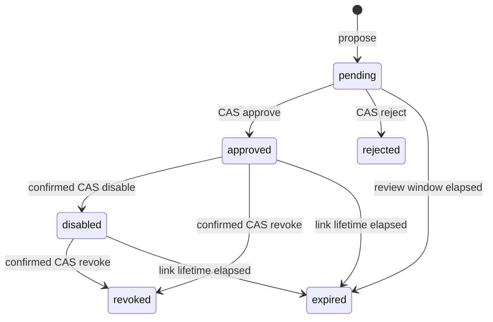

# Bridge Governance Operations

SYNAPSE-S2 bridge governance authorizes bounded, one-hop **recall** across
saved memory namespaces. It does not copy memories, synchronize namespace
contents, write spike payloads across contexts, or create a general-purpose
data-sharing channel.

This document describes the repository implementation. It is not evidence that
the live Mac has been cut over to the authoritative v6 core or that a particular
bridge is active. Confirm the installed authority and health first with the
procedure in [Authoritative Core Operations](AUTHORITATIVE_CORE_OPERATIONS.md).

## Production invariants

1. `local` is the default recall scope. A namespace remains isolated unless a
   caller deliberately selects `connected` or the explicitly broad `all` scope.
2. `connected` includes only the selected namespace, inherited `global`
   memory, and directly adjacent namespaces authorized by an effective
   governed link. It never follows a second hop.
3. Pending, rejected, disabled, revoked, and expired proposals do not authorize
   connected recall. Suggestions never authorize recall.
4. A bridge authorizes reads only. Every governance projection and event sets
   `automatic_cross_namespace_write` to `false`.
5. Active-link resolution is fail-closed. The proposal projection, link
   projection, durable relationship row, embedded governance evidence,
   last append-only receipt, revision chain, direction, enabled state, and
   expiry must agree before a link is used.
6. Directed links authorize recall from source to target only. Bidirectional
   links authorize either direction and are stored in canonical endpoint order.
7. The `all` scope is a separate, explicit broad-recall choice. It does not
   require bridges and must not be treated as a governed substitute for
   `connected`.

The bridge itself does not grant operating-system access, authenticate a remote
Mac, or weaken the dashboard/core boundary. It changes only the namespace set
eligible for a recall request that explicitly asks for `connected` scope.
Namespaces are semantic partitions inside one trusted local-owner system, not
multi-tenant confidentiality or authorization domains.

## Durable model and transaction boundary

Governance uses the certified v6 schema's versioned extension points rather
than adding ad hoc tables:

| Durable surface | Purpose |
| --- | --- |
| `synapse-s2.bridge-proposal.v1` projection | Current proposal state and immutable bridge request |
| `synapse-s2.bridge-link-projection.v1` projection | Governed view of a materialized link |
| `context_relationships` row | Durable typed link consulted by connected recall |
| `synapse-s2.bridge-governance-event.v1` maintenance receipt | Append-only transition evidence |
| `synapse-s2.namespace-catalog.v1` metadata | Persistent record that a namespace has been observed |

A proposal review, direct compatibility approval, disable, revoke, or expiry
materialization updates every affected projection, durable link, and event
receipt inside one SQLite `BEGIN IMMEDIATE` transaction. If any write fails,
the transition rolls back as a unit.

Each projection has a canonical SHA-256 `revision`. Review, disable, and revoke
require the exact revision the operator inspected. A `governance_request_id`
provides operation idempotency: reusing it with the same sanitized request
replays the recorded result; reusing it for different content is rejected as a
conflict. When the caller omits the id, the engine deterministically derives
one from the action and sanitized request fingerprint, so an identical retry
replays instead of creating another proposal. Supply a fresh explicit id when
an otherwise identical request is a genuinely new governance decision.

Before a proposal can be listed, reviewed, replayed, or used for active recall,
its canonical projection is rebound to its recorded last event: operation id,
action, request id, source context, revision, state, proposal/link ids, event
sequence, actor field, no-auto-write marker, and stored result must agree. A
projection edit cannot be laundered through a later review or retry.

Reasons and evidence are redacted and bounded before persistence. Secret-shaped
identifiers are rejected, untrusted raw digest fields are removed, evidence is
limited to 8,192 canonical JSON bytes, and reasons are limited to 1,024 bytes.
These controls are guardrails, not permission to place credentials, tokens,
private keys, or unnecessary personal data in governance evidence.

## Lifecycle and CAS rules



`rejected`, `revoked`, and `expired` are terminal. A disabled link cannot be
re-enabled. Create and review a new proposal if access should return.

### 1. Propose

A proposal normalizes source, target, direction, relation type, weight, and
evidence; records both namespaces in the durable namespace catalog; and writes
one `pending` projection plus one proposal event. It does **not** create a
durable link or expand recall.

The backend augments proposal evidence with current density-normalized
similarity evidence and an entries-revision over both namespaces. Approval
rechecks that entries-revision. If either namespace's memory corpus changed,
the review is rejected as stale and the operator must create a new proposal
from current evidence.

Proposal expiry defaults to seven days. An explicit proposal lifetime must be
between 60 seconds and 30 days from trusted core time.

### 2. Two-step review with compare-and-swap

The reviewer must supply the exact `proposal.revision` returned by the proposal
they inspected. The decision is `approve` or `reject`. Approval materializes
the durable relationship and link projection; rejection never creates a link.
Concurrent reviews of one revision have exactly one winner. A stale revision,
expired proposal, non-pending state, or proposed link expiry that elapsed while
the proposal was pending is rejected.

The governance engine supports a strict distinct-reviewer policy by default.
The current single-local-owner `SpikingAttentionBackend` intentionally
configures that identity check off. Proposal and review remain two separate,
revision-bound steps, but the production actor is the same verified local owner
for both. This is deliberate review friction, not two-person approval.
Organizations that require separation of duties need an external identity and
approval control before enabling a bridge.

### 3. Actor binding in the authoritative core

For governed core mutations, the authoritative service first verifies the Unix
socket peer UID is the service owner's UID. It then discards caller-supplied
`proposed_by`, `reviewed_by`, `approved_by`, `disabled_by`, and `revoked_by`
values and records `core:local-owner:<digest>`, derived from that OS-verified
local-owner principal.

Client-selected caller labels are routing/audit labels, not identities, and do
not change the governance actor. Two adapters running as the same local owner
record the same actor. This prevents a bound client from forging a second local
actor, but it does not identify a human or create independent approvers. Before
v6 adoption, the repository-local compatibility backend cannot provide the
same OS-bound actor guarantee; production governance evidence therefore
requires the authoritative-core lane.

### 4. Compatibility approval lane

The legacy direct-approval surfaces remain available for compatibility:

- CLI `namespace-link`
- dashboard `POST /api/namespace-links`
- core operation `approve_namespace_link`

This lane is permitted only in the explicitly privileged backend configuration,
requires `confirm=true`, requires the link to start enabled, and is refused when
distinct-reviewer enforcement is active. It atomically records both a pending
proposal event and an approval event before returning; it does not create an
ungoverned row or bypass the integrity audit.

Use proposal/review/CAS for new production work. Treat direct approval as a
compatibility surface, not the normal change-management path. On the bound core
it still records the OS-verified local-owner actor; it does not prove a separate
reviewer. The MCP registry deliberately exposes no approval or general review
tool: an agent may propose a bridge, reject a pending proposal, and inspect
history/audit evidence, but it cannot grant itself connected recall.

### 5. Expire, disable, and revoke

An optional link expiry must be between 60 seconds and 366 days from trusted
core time. Expired authorization is denied immediately during active-link
resolution, even before the durable state is materialized. Run the expiry sweep
to record the `system-expiry` event and disable the durable row. Before that
sweep, replay returns `state=expired`, `authorization_active=false`, and a
masked `link.enabled=false` without mutating the store. The integrity audit
remains `ready` but reports `expiry_due_count` and
`expiry_materialization_required=true` as maintenance evidence.

`disable` is a confirmed, CAS-bound containment action for an approved link.
It preserves the row and history but removes connected recall. `revoke` is the
terminal confirmed action for an approved or disabled link. The legacy delete
core operation is converted to governed revocation, requires the caller's exact
observed revision, and does not erase audit history.

## Namespace catalog and galaxy behavior

The namespace catalog preserves a versioned record when a namespace is first
observed through a memory entry, context-bus event, or bridge proposal. The
catalog is included in logical snapshots and verified recovery bundles. As a
result, `list_namespace_map` and the Namespace Galaxy can continue to show a
known namespace even when its current memory-entry count is zero.

The map returns:

- every bounded catalog/current-data namespace summary;
- effective approved links only;
- pending and historical proposal projections;
- optional read-only, density-normalized suggestions;
- governance mode, counts, and the one-hop/no-auto-write declaration.

Galaxy node size is derived from current entry volume. Suggestions and visual
phase-delay values are presentation evidence only. They do not create a link,
change recall scope, or implement time-delayed spike synchronization.

The catalog is not an ACL, a namespace ownership registry, or a deletion
tombstone. It currently records state as `active` and has no rename/archive
lifecycle. A namespace that disappeared before catalog support and has no
remaining durable data may be absent until it is observed again.

## Supported surfaces

All dashboard routes below require the authenticated dashboard session
described in [Authoritative Core Operations](AUTHORITATIVE_CORE_OPERATIONS.md).
Do not use a bare loopback URL or unauthenticated `curl` as an operator path.

| Action | CLI | Authoritative core operation | MCP tool | Dashboard API |
| --- | --- | --- | --- | --- |
| Map/catalog and suggestions | `namespace-map` | `list_namespace_map` | `list_spiking_namespace_map` | `GET /api/namespace-map` |
| Propose | `namespace-link-propose` | `propose_namespace_link` | `propose_spiking_namespace_link` | `POST /api/namespace-link-proposals` |
| List proposals | `namespace-link-proposals` | `list_namespace_link_proposals` | — | `GET /api/namespace-link-proposals` |
| History | `namespace-link-history` | `list_namespace_link_history` | `list_spiking_namespace_link_history` | — |
| CAS approve/reject | `namespace-link-review` | `review_namespace_link` | reject only: `reject_spiking_namespace_link` | `POST /api/namespace-link-reviews` |
| Direct compatibility approval | `namespace-link` | `approve_namespace_link` | deliberately unavailable | `POST /api/namespace-links` |
| Disable | `namespace-link-disable` | `disable_namespace_link` | — | — |
| Revoke | `namespace-link-revoke` | `revoke_namespace_link` | — | `POST /api/namespace-link-revocations` |
| Materialize expiries | `namespace-link-expire` | `expire_namespace_links` | — | — |
| Integrity audit | `namespace-link-audit` | `audit_namespace_link_governance` | `audit_spiking_namespace_link_governance` | `GET /api/namespace-link-governance` |

The dashboard intentionally exposes only a subset of maintenance operations.
Use the bound CLI/core lane for disable, expiry materialization, and complete
history inspection.

## Safe operator runbook

Run these commands from the repository root. When the authoritative binding is
installed, the CLI routes to the same core used by MCP and the dashboard.

### Preflight

Materialize expected expiries, then require a ready audit before proposing or
reviewing a bridge:

```bash
.venv/bin/python synapse_cli.py --json namespace-link-expire
.venv/bin/python synapse_cli.py --json namespace-link-audit
.venv/bin/python synapse_cli.py --json namespace-link-proposals \
  --context default \
  --limit 100
.venv/bin/python synapse_cli.py --json namespace-map \
  --context default \
  --limit 500
```

Stop if the audit is `degraded`. Do not approve around an integrity error.

### Propose and capture the reviewed revision

The following shell fragment keeps the exact returned proposal id and revision
together. Replace the example namespaces, reason, and evidence with the current
change record.

```bash
REQUEST_ID="bridge-proposal-default-ptz-$(date +%s)"
LINK_EXPIRES_AT="$(( $(date +%s) + 2592000 ))"

proposal_json="$(
  .venv/bin/python synapse_cli.py --json namespace-link-propose \
    --source-context default \
    --target-context PTZ-Camera \
    --relation-type related \
    --direction bidirectional \
    --weight 0.75 \
    --reason 'Current reviewed work requires one-hop connected recall.' \
    --evidence '{"change_record":"CHG-REPLACE-ME"}' \
    --link-expires-at "$LINK_EXPIRES_AT" \
    --governance-request-id "$REQUEST_ID"
)" || exit 1

printf '%s\n' "$proposal_json"
PROPOSAL_ID="$(printf '%s' "$proposal_json" | \
  .venv/bin/python -c 'import json,sys; print(json.load(sys.stdin)["proposal"]["proposal_id"])')"
EXPECTED_REVISION="$(printf '%s' "$proposal_json" | \
  .venv/bin/python -c 'import json,sys; print(json.load(sys.stdin)["proposal"]["revision"])')"
```

Inspect the returned endpoints, direction, relation, weight, evidence,
`proposal_expires_at`, `link_expires_at`, actor, and revision. Do not proceed if
the scope or evidence is broader than intended.

### Approve or reject the exact proposal

```bash
review_json="$(
  .venv/bin/python synapse_cli.py --json namespace-link-review \
    --proposal-id "$PROPOSAL_ID" \
    --decision approve \
    --expected-revision "$EXPECTED_REVISION" \
    --reason 'Reviewed endpoints, direction, evidence, scope, and expiry.' \
    --governance-request-id "bridge-review-${PROPOSAL_ID}"
)" || exit 1

printf '%s\n' "$review_json"
CONTEXT_LINK_ID="$(printf '%s' "$review_json" | \
  .venv/bin/python -c 'import json,sys; print(json.load(sys.stdin)["proposal"]["context_link_id"])')"
CURRENT_REVISION="$(printf '%s' "$review_json" | \
  .venv/bin/python -c 'import json,sys; print(json.load(sys.stdin)["proposal"]["revision"])')"
```

Use `--decision reject` with an evidence-based reason when the proposal should
not proceed. Rejection is terminal and creates no link.

### Verify authorization and provenance

```bash
.venv/bin/python synapse_cli.py --json namespace-link-audit
.venv/bin/python synapse_cli.py --json namespace-link-history \
  --proposal-id "$PROPOSAL_ID" \
  --limit 100
.venv/bin/python synapse_cli.py --json namespace-map \
  --context default \
  --no-suggestions \
  --limit 500
.venv/bin/python synapse_cli.py --json retrieve-v2 \
  --context default \
  --scope connected \
  --prompt 'current PTZ camera work' \
  --result-limit 10 \
  --candidate-limit 64
```

Verify that every cross-namespace retrieval result names the exact approved
one-hop link and connected-scope provenance. Compare against the same request
with `--scope local` when validating isolation.

### Contain or retire a bridge

Disable is the reversible operational concept, but the current state machine
does not re-enable the same proposal. Re-establishment requires a new proposal.

```bash
disabled_json="$(
  .venv/bin/python synapse_cli.py --json namespace-link-disable \
    --context-link-id "$CONTEXT_LINK_ID" \
    --expected-revision "$CURRENT_REVISION" \
    --reason 'Contain connected recall while the scope is re-evaluated.' \
    --governance-request-id "bridge-disable-${CONTEXT_LINK_ID}-$(date +%s)" \
    --confirm
)" || exit 1

printf '%s\n' "$disabled_json"
CURRENT_REVISION="$(printf '%s' "$disabled_json" | \
  .venv/bin/python -c 'import json,sys; print(json.load(sys.stdin)["proposal"]["revision"])')"

.venv/bin/python synapse_cli.py --json namespace-link-revoke \
  --context-link-id "$CONTEXT_LINK_ID" \
  --expected-revision "$CURRENT_REVISION" \
  --reason 'The reviewed bridge is retired.' \
  --governance-request-id "bridge-revoke-${CONTEXT_LINK_ID}-$(date +%s)" \
  --confirm

.venv/bin/python synapse_cli.py --json namespace-link-audit
```

If immediate containment is required and governance integrity is already
degraded, force callers back to `local` scope first. A corrupt governance store
is not a reason to select `all`.

## Audit and repair semantics

`namespace-link-audit` is read-only. It verifies, among other things:

- canonical projection revisions and schemas;
- proposal/event sequence, revision chain, and legal transitions;
- last-event projection-to-receipt bindings, actor, reason, request fingerprint,
  transition timestamp, result-envelope claims, and no-auto-write declarations;
- proposal/link projection agreement;
- durable row structure, actor/time provenance, enabled state, full evidence,
  and exact last-receipt binding;
- missing projections, missing history, missing materialized link surfaces, and
  ungoverned durable links;
- bounded capacity, with at most 10,000 rows per audited surface and 100 error
  samples returned.

The returned `audit_revision` binds bounded raw-row digests for projections,
receipts, and durable links as well as the interpreted errors and expiry-due
count. Any selected-row change therefore changes the revision even if it keeps
the same error category. The revision is not a repair authorization token.

There is deliberately **no bridge-specific repair command or API**. The only
supported normalization is the expiry sweep for otherwise valid due records.
For any other degraded result:

1. stop using `connected` and `all`; use `local` recall only;
2. preserve the exact audit output, proposal list, and available history;
3. do not edit `store_metadata`, maintenance receipts, or
   `context_relationships` with direct SQL;
4. create and verify a recovery point according to
   [Authoritative Core Operations](AUTHORITATIVE_CORE_OPERATIONS.md);
5. diagnose the first audit error against a verified isolated restore;
6. restore through the governed recovery lane if durable state is corrupt;
7. rerun expiry materialization and the audit; only resume connected recall
   after `status` is `ready`;
8. create a new proposal rather than fabricating or rewriting governance
   history.

The recovery operations in steps 4-6 run through the closed one-hour
recovery-maintenance lane. That longer execution budget exists so a large
paired snapshot and isolated proof can finish; it does not authorize, renew, or
apply any bridge decision. Bridge proposal, audit-revision, confirmation, and
expiry rules remain separate and unchanged. If recovery loses its response,
reconcile the exact request before continuing and never use a bridge mutation
as a retry mechanism.

Invalid or tampered link structures are skipped by active-link resolution, so
connected recall fails closed even while audit status is degraded. That safety
property does not make a degraded store production-ready.

History listing validates every selected receipt's event identity, transition
result, actor, reason, request fingerprint, timestamp, and revision before
returning it. A history response is not self-attesting by itself; still require
a `ready` integrity audit before relying on the wider governance store.

## Current limitations and non-claims

- Bridge governance controls one-hop recall eligibility, not write replication,
  event delivery, or multi-Mac synchronization.
- There is no multi-hop traversal, transitive trust, wildcard bridge, or
  automatic bridge approval.
- Suggestions, weights, Dice scores, and phase-delay values are not confidence,
  truth, access-control, or biological synchronization guarantees.
- The current single-local-owner backend provides two-step review but does not
  enforce a second human reviewer or distinguish same-UID adapters as principals.
- The compatibility approval lane remains callable through privileged
  operator/core surfaces and should be monitored or policy-disabled where
  staged review is mandatory; it is deliberately absent from the MCP registry.
- Expiry authorization is fail-closed at read time, but materialized expiry
  history requires the explicit expiry sweep.
- The catalog has no archive/delete/rename governance and may not reconstruct a
  pre-catalog namespace that left no durable evidence.
- Audit and list surfaces are deliberately bounded. Capacity degradation must
  be handled operationally rather than interpreted as a partial ready result.
- `all` is an explicit broad-recall mode outside bridge authorization. Clients
  that require bridge isolation must disallow it in their own policy.
