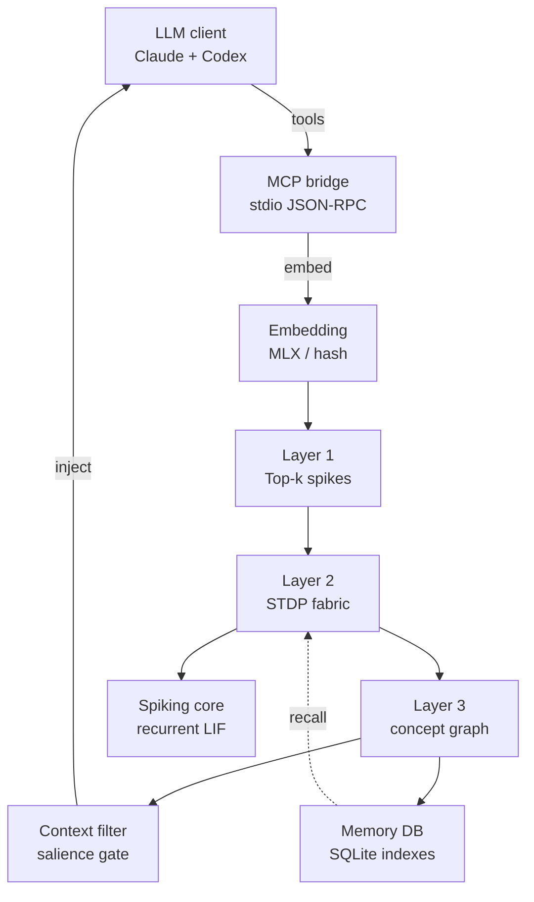
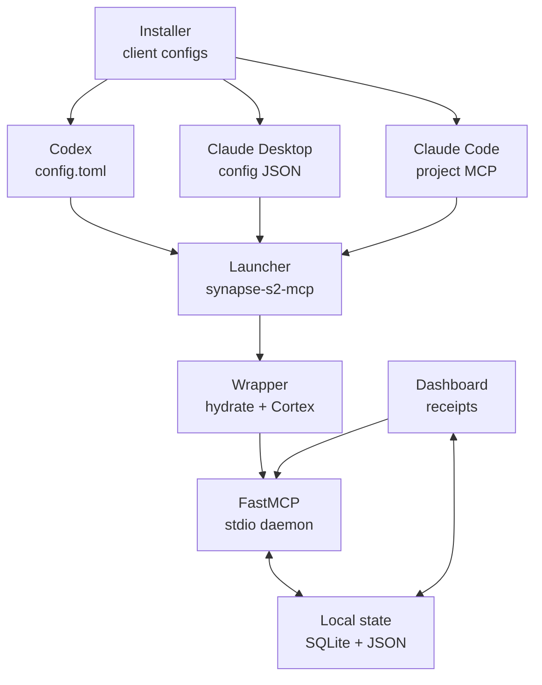
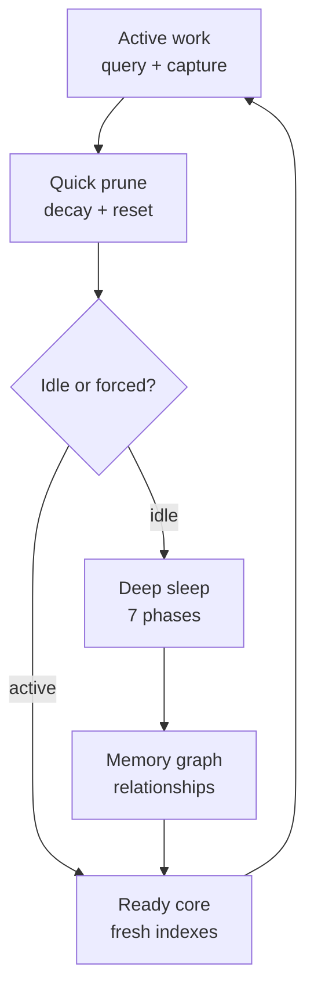

# **Neuromorphic Spiking Attention Plugin for Local AI Clients: An Apple Silicon Optimized MCP Architecture**

## **Neuromorphic Foundations of Spiking Attention**

Traditional Transformer attention calculates dense dot-product attention maps. For an input sequence $X \in \mathbb{R}^{N \times d}$:

$$
Q = XW_Q,\quad K = XW_K,\quad V = XW_V
$$

$$
S = \frac{QK^\top}{\sqrt{d_k}},\quad A = \operatorname{softmax}(S),\quad Y = AV
$$

The score matrix $S$ and probability matrix $A$ are both $N \times N$, so attention memory grows as $\Theta(N^2)$ per head. This is the practical long-context memory wall: increasing sequence length increases attention-matrix storage quadratically before counting value activations, KV cache, batch size, or layer count.

SYNAPSE-S2 moves the recall problem away from request-time all-pairs token attention. A local embedding vector is projected into a sparse sensory spike pattern:

$$
Z_i = \frac{E_i - \mu_E}{\sigma_E},\quad
s_i =
\begin{cases}
1 & \text{if } i \in \operatorname{argTopK}(Z,k) \\
0 & \text{otherwise}
\end{cases}
$$

The active sparse pattern is then propagated through bounded Leaky Integrate-and-Fire dynamics. The production loop first combines sensory and lateral current:

$$
X_t = S_{\text{in}}W_{\text{syn}}\gamma_{\text{syn}} + S_tW_{\text{lat}}\gamma_{\text{lat}}
$$

and then applies the subtract-reset LIF step:

$$
\tilde{U}_{t+1} = \beta U_t + X_t,\quad
S_{t+1}=H(\tilde{U}_{t+1}-V_{\text{thr}}),\quad
U_{t+1}=\tilde{U}_{t+1}-S_{t+1}V_{\text{thr}}
$$

where $U$ is membrane potential, $X$ is synaptic input current, $S$ is the emitted binary spike state, $\beta \in (0,1)$ is leak/decay, and $V_{\text{thr}}$ is the firing threshold. Information salience is encoded in which neurons fire and when, not in a dense token-token attention matrix.

Temporal co-activation is consolidated through the implemented one-step discrete STDP update:

$$
\Delta W_{ij} =
A_+e^{-1/\tau_+}S_i[t]S_j[t+1]
-
A_-e^{-1/\tau_-}S_i[t+1]S_j[t]
$$

$$
W_{ij} \leftarrow \operatorname{clip}(W_{ij}+\Delta W_{ij}, -c, c)
$$

This is a fixed-step version of the usual exponential STDP rule: previous spikes potentiate current spikes in the forward direction, current spikes depress the reverse direction, and lateral weights stay inside a configured clip envelope. The runtime also skips STDP when the active set exceeds the configured guardrail. Repeated co-activation becomes durable synaptic and graph structure, so later recall can follow learned sparse activation paths and indexed memory relationships. This avoids materializing Transformer-style $N \times N$ attention matrices during recall. It does not mean the implementation has no multiplications anywhere; decay, weighting, MLX setup, and indexing still use ordinary numeric operations where useful.

## **Unified Memory and Hardware-Level Optimization on Apple Silicon**

Executing complex spiking simulations on consumer hardware typically introduces severe thermal and processing overhead, particularly when standard machine learning libraries are forced to bridge data across discrete CPU and GPU boundaries.5 On Apple Silicon, this bottleneck is resolved by utilizing the MLX framework, a specialized numerical computation engine designed from the ground up for unified memory architectures.5 By leveraging unified memory, the physical RAM of the host Mac device is shared directly between the CPU and the M-series GPU.5 There is no requirement to copy large tensor projections across PCI buses, enabling the local stack to scale temporal windows and manage multi-layered spiking structures with minimal resource impact.5
The backend of the spiking engine is constructed natively with the mlx-snn library, which inherits directly from mlx.core.6 The library uses functional state passing, where the active state of every simulated neuron is managed as a standard Python dictionary rather than a mutable, hidden class state.5 This explicit state pattern is compatible with MLX's high-level functional transforms 5:

* **Lazy Evaluation (mx.eval)**: Operations build a deferred computation graph that executes only when a result is explicitly demanded.5 For temporal spiking loops, the unrolled execution graph across $T$ timesteps can be optimized, scheduled, and compiled as a unified operation, reducing memory allocation cycles.5
* **Just-In-Time Compilation (mx.compile)**: The state transitions of recurrent spiking layers are JIT-compiled into optimized Metal kernels, executing natively on the M-series GPU accelerators.6
* **Immutable Array Updates**: MLX prohibits in-place array mutations to ensure mathematical purity in the computation graph.5 Neuron potential resets must be declared as functional assignments (e.g., mem \= beta \* mem \+ x rather than mem \+= x), allowing the compiler to optimize the memory hierarchy.5

The shipped runtime uses recurrent LIF with `mlxsnn.Leaky` when available and an explicit MLX subtract-reset fallback when it is not. MSLeaky, ALIF, chunked BPTT, state detachment, and STE training are architecture-compatible research extensions, not the current production inference path. If a future training mode is added, gradient propagation through the non-differentiable Heaviside step function can use a Straight-Through Estimator (STE) pattern:

$$
\frac{\partial H(x)}{\partial x} \approx \frac{\partial \sigma_{\text{surrogate}}(x)}{\partial x}
$$

where $H(x)$ is the unit step function and $\sigma_{\text{surrogate}}(x)$ is a differentiable approximation such as a fast sigmoid or arctangent curve.5

| Neuron Model | Update Equations | State Vector | Dynamics & Presets |
| :---- | :---- | :---- | :---- |
| **Leaky Integrate-and-Fire (LIF)** | $U[t+1] = \beta U[t] + X[t+1] - S[t]V_{\text{thr}}$ | state\["mem"\] 11 | Standard first-order decay 5 |
| **Integrate-and-Fire (IF)** | $U[t+1] = U[t] + X[t+1] - S[t]V_{\text{thr}}$ | state\["mem"\] 11 | Non-leaky perfect integration with $\beta = 1$ 5 |
| **Adaptive LIF (ALIF)** | LIF plus $V_{\text{thr}}[t+1] = V_{\text{base}} + a[t]$ | state\["mem"\], state\["adapt"\] 11 | Spike-frequency adaptation with dynamic threshold 5 |
| **Multi-Scale Leaky (MSLeaky)** | Branch-specific $\beta_f$ decay rates | state\["mem"\] per branch 11 | Frequency-matched decay modeling EEG bands 11 |
| **Recurrent LIF (RLeaky)** | Integrates learnable recurrent synaptic feedback | state\["mem"\], state\["spk"\] 11 | Recurrent layer topologies with local loops 11 |

| Computational Backend | Peak GPU Allocation | Sequence Scaling Limit | Compilation Compatibility | Efficiency Factor (relative to V100/MPS) |
| :---- | :---- | :---- | :---- | :---- |
| **mlx-snn (Apple M-Series Native)** | Unified memory and local MLX arrays | $T$ unrolled steps | mx.compile (Full JIT graph execution) 5 | Baseline native path with current system-efficiency target 11 |
| **snnTorch (Apple Silicon MPS)** | MPS memory pressure | $T$ unrolled steps with VRAM wall risk | Limited tracing, VJP shape mismatches 5 | Slower execution latency 5 |
| **snnTorch (Host CPU Execution)** | System RAM bound | System memory execution limits | Standard TorchScript JIT | Slower execution latency 6 |

## **Hybrid Cognitive Architecture and Spreading Activation**

The implementation decouples abstract semantic operations from associative memory consolidation.8 Traditional retrieval-augmented generation (RAG) isolates historical data within static databases, retrieving information via mathematical vector similarity searches that fail to capture historical co-activation structures.8 The hybrid SNN-LLM architecture, inspired by the EMBER framework, places the localized LLM inside a persistent, biologically grounded memory substrate.8

The system is organized into a multi-tiered spiking neural network featuring hierarchical sensory, concept, and categorical layer topologies.8 Layer 1 acts as a fixed sensory translation barrier, mapping standardized input embeddings into precise spatial spike distributions.8 Layer 2 functions as the plastic associative fabric, where dynamic connections are established, potentiated, or depressed based on temporal co-occurrence via active STDP rules.8 Layer 3 maps these associations into abstract conceptual groupings, stabilizing memory recall.8
Rather than executing a database query, the system streams prompt embeddings directly into the sensory layer as localized spike patterns.8 This stimulus propagates laterally through the recurrent connections of the associative fabric, triggering spreading activation.8 This lateral cascade acts as an implicit, neuromorphic attention filter, selectively amplifying historical concepts that are dynamically related to the current context.8 Because the network is configured with balanced excitatory and inhibitory populations, self-limiting lateral inhibition prevents runaway activation cascades, ensuring that only the most relevant, tightly coupled memory pathways fire.8
To structuralize this stream, the architecture integrates a dual-graph memory protocol called Hebbian Distillation (derived from HeLa-Mem) alongside a Bayesian Surprise Event Segmenter (derived from EM-LLM).14 Incoming text sequences are analyzed by the Bayesian surprise engine, which monitors semantic transitions and projects graph-theoretic boundaries around distinct events in real-time.18 These segmented events are registered as co-activation vectors within the episodic memory graph.14 As connections strengthen through repeated co-activation, a background distillation process detects densely connected memory hubs and refines them into structured semantic knowledge, mirroring the episodic-semantic distinction in human cognition.14
Synaptic connections are dynamically gated by contextual configurations, mimicking the prefrontal cortex context-gating mechanisms.19 An external context signal, derived from active runtime parameters or historical sequences, selectively silences specific neural clusters, reconfiguring the effective network connectivity map.20 This architectural design enables local task switching with zero mutual interference, preserving consolidated memory spaces from catastrophic forgetting during multi-turn local interactions.19

## **Rapid Implementation Blueprint and Configuration Shortcuts**

The local plugin integrates with Codex Client, Claude Desktop, and Claude Code through the Model Context Protocol (MCP).21 The MCP acts as a standard middleware layer, enabling local LLM clients to communicate with background processes via JSON-RPC 2.0 messages.15 To minimize runtime overhead and eliminate the complexity of network handshakes, the transport layer is established entirely over standard input/output (stdio) channels.15 Standard output (stdout) is reserved strictly for JSON-RPC serialization, while standard error (stderr) is utilized for logging, preventing packet corruption.25
The primary rapid-development shortcut lies in configuring a single, unified local FastMCP python process communicating over stdio.15 This architecture allows Claude Code, Codex Client, and Claude Desktop to point to the exact same local python runtime.26 By accessing a single background process, these different interfaces share the cached neural weights, connection mappings, and local state.26 This design provides a unified, cross-application memory system without requiring complex sync daemons or file lock managers.27

To accelerate installation, developers can use the FastMCP CLI to automatically register the server with the local Claude Desktop configuration using a single terminal command.31 The CLI scans active local editor instances and configures environment paths, eliminating manual editing of deep system directories.32 Additionally, when spawning the MCP server, Claude Code injects the CLAUDE\_PROJECT\_DIR environment variable.29 The spiking engine reads this parameter to locate workspace-specific weights and adapt its context gating dynamically.29

| Local Client | Configuration Path | Scope Precedence | Core Transport |
| :---- | :---- | :---- | :---- |
| **Claude Code** | \~/.claude.json 28 | Local \> Project \> User 23 | stdio process command 23 |
| **Claude Desktop** | \~/Library/Application Support/Claude/claude\_desktop\_config.json 25 | Global User Environment | stdio process command 25 |
| **Codex Client** | \~/.codex/config.toml 22 | User / Project-scoped .codex/config.toml 26 | stdio table process mapping 26 |

## **Complete System Wireframes and Implementation Code**

The implementation of the spiking attention plugin consists of three primary code layers: the FastMCP server wrapper, the mlx-snn simulation backend, and the client configuration manifests.

### **FastMCP Server Wrapper (mcp\_server.py)**

This file implements the MCP server interface, exposing high-level tools for neuromorphic attention encoding and offline consolidation.

Python
import os
import sys
import logging
from typing import Dict, Any, List
from fastmcp import FastMCP
import mlx.core as mx

\# Ensure all standard logging is directed safely to stderr to avoid corrupting stdio transport
logging.basicConfig(level=logging.INFO, stream=sys.stderr)
logger \= logging.getLogger("neuromorphic\_mcp\_server")

\# Initialize FastMCP Server Instance
mcp \= FastMCP(
    name="SpikingAttentionEngine",
    dependencies=\["mlx", "mlx-snn", "numpy"\]
)

\# Import the local Apple Silicon optimized spiking backend
try:
    import mlx\_backend as snn\_engine
    backend\_active \= True
    logger.info("Successfully initialized local Apple Silicon spiking engine.")
except ImportError as e:
    backend\_active \= False
    logger.error(f"Failed to load mlxsnn-based backend: {str(e)}")

@mcp.tool(
    annotations={
        "title": "Query Spiking Associative Memory",
        "readOnlyHint": True
    }
)
def query\_spiking\_attention(prompt\_embedding: List\[float\], context\_id: str \= "default") \-\> str:
    """Processes a prompt vector through a persistent spiking neural network
    using STDP lateral propagation. Returns activated contextual associations
    and historical memory items to guide the LLM's next generation step.

    Args:
        prompt\_embedding: The dense floating-point embedding of the current user prompt.
        context\_id: A unique identifier representing the active session or task scope.
    """
    if not backend\_active:
        return "Spiking attention backend is unavailable. Standard fallback routing active."

    try:
        \# Convert incoming list into a native MLX Array
        embedding\_arr \= mx.array(prompt\_embedding)

        \# Pass representation into the mlx-snn associative fabric
        activated\_associations \= snn\_engine.simulate\_spiking\_retrieval(
            embedding=embedding\_arr,
            context\_id=context\_id
        )

        \# Format the associative output as structured prompt context
        return activated\_associations
    except Exception as e:
        logger.error(f"Error during spiking memory retrieval: {str(e)}")
        return f"Spiking attention error occurred: {str(e)}"

@mcp.tool()
def trigger\_sleep\_consolidation() \-\> str:
    """Triggers an offline consolidation sequence inside the spiking network.
    Runs weight decay, synaptic clustering, and memory rescoring to optimize
    the local model's parameters and free hardware resources.
    """
    if not backend\_active:
        return "Backend inactive."

    try:
        status \= snn\_engine.run\_offline\_consolidation()
        return f"Consolidation complete: {status}"
    except Exception as e:
        logger.error(f"Error during consolidation execution: {str(e)}")
        return f"Consolidation failure: {str(e)}"

if \_\_name\_\_ \== "\_\_main\_\_":
    \# Start the server on local stdio transport
    mcp.run()

### **Apple Silicon Spiking Engine Backend (mlx\_backend.py)**

This module manages the execution of the neuromorphic network, performing embedding standardization, sparse spike encoding, and state updates via mlx-snn.

Python
import mlx.core as mx
import mlxsnn
from typing import Dict, Any, List

class SpikingAttentionBackend:
    def \_\_init\_\_(self, dimension: int \= 1024, num\_neurons: int \= 5000):
        self.dimension \= dimension
        self.num\_neurons \= num\_neurons

        \# Configure a Leaky Integrate-and-Fire neuron layer natively in mlx-snn
        self.lif\_layer \= mlxsnn.Leaky(beta=0.95, learn\_threshold=True)

        \# Initialize explicit state dictionary
        self.state \= self.lif\_layer.init\_state(batch\_size=1, features=self.num\_neurons)

        \# Synaptic connection weight matrix (excitatory-inhibitory balanced)
        \# Using native MLX array initialization
        self.W\_syn \= mx.random.normal((dimension, num\_neurons)) \* 0.01
        self.W\_lateral \= mx.random.normal((num\_neurons, num\_neurons)) \* 0.002

        \# Persistent episodic memory references
        self.memory\_mapping: Dict\[int, str\] \= {}
        self.active\_traces \= mx.zeros((num\_neurons,))

    def encode\_to\_spikes\_top\_k(self, embedding: mx.array, k: int \= 150\) \-\> mx.array:
        """Translates a dense vector embedding into a sparse population code
        using standardized z-scores.
        """
        mean \= mx.mean(embedding)
        std \= mx.sqrt(mx.var(embedding) \+ 1e-5)
        z\_scores \= (embedding \- mean) / std

        \# Retrieve value at k-th percentile using sorting/partitioning
        sorted\_scores \= mx.sort(z\_scores)
        threshold\_val \= sorted\_scores\[-k\]

        \# Binary spiking mask
        spikes \= mx.where(z\_scores \>= threshold\_val, 1.0, 0.0)
        return spikes

    def run\_snn\_cycle(self, sensory\_spikes: mx.array, steps: int \= 20\) \-\> mx.array:
        """Simulates the lateral propagation of spikes over a finite set of steps,
        recording localized neural activation.
        """
        \# Projects sensory spikes through synaptic projections
        input\_current \= mx.matmul(sensory\_spikes, self.W\_syn)

        \# Create a local state reference
        current\_state \= self.state
        accumulated\_spikes \= mx.zeros((self.num\_neurons,))

        for t in range(steps):
            \# Integrate current and lateral spiking feedback
            lateral\_current \= mx.matmul(accumulated\_spikes, self.W\_lateral)
            total\_current \= input\_current \+ lateral\_current

            \# Forward step through mlx-snn LIF module
            spk, current\_state \= self.lif\_layer(total\_current, current\_state)

            \# Accumulate output spikes functionally
            accumulated\_spikes \= accumulated\_spikes \+ spk

        \# Update explicit simulation state
        self.state \= current\_state
        return accumulated\_spikes

\# Singleton instantiation for localized process scope
\_engine\_instance \= SpikingAttentionBackend()

def simulate\_spiking\_retrieval(embedding: mx.array, context\_id: str) \-\> str:
    """Simulates top-down attention and lateral propagation to select context.
    """
    sensory\_spikes \= \_engine\_instance.encode\_to\_spikes\_top\_k(embedding)
    firing\_signature \= \_engine\_instance.run\_snn\_cycle(sensory\_spikes)

    \# Retrieve indices of maximum activity
    active\_neurons \= mx.argsort(firing\_signature)\[-5:\]
    active\_indices \= active\_neurons.tolist()

    \# Map firing indices to structured context segments
    retrieved\_concepts \=
    for idx in active\_indices:
        if idx in \_engine\_instance.memory\_mapping:
            retrieved\_concepts.append(\_engine\_instance.memory\_mapping\[idx\])

    if not retrieved\_concepts:
        return "No high-salience spiking patterns registered. Fallback context active."

    return " / ".join(retrieved\_concepts)

def run\_offline\_consolidation() \-\> str:
    """Simulates synaptic homeostasis, decaying baseline connections and consolidated pathways.
    """
    \# Exponent-based decay mimicking biological synaptic normalization
    \_engine\_instance.W\_lateral \= \_engine\_instance.W\_lateral \* 0.98
    \_engine\_instance.W\_syn \= \_engine\_instance.W\_syn \* 0.99

    \# Flush current transient potentials to prepare for subsequent execution cycles
    \_engine\_instance.state\["mem"\] \= mx.zeros\_like(\_engine\_instance.state\["mem"\])
    return "Homeostasis decay and synaptic scaling complete."

### **Codex Configuration (\~/.codex/config.toml)**

This configuration registers the stdio process within the Codex runtime workspace.

Ini, TOML
\# General Model Context Protocol Client Settings for local execution
mcp\_oauth\_callback\_port \= 5555

\[mcp\_servers.spiking\_attention\]
command \= "uv"
args \= \[
    "--directory",
    "/Users/localuser/projects/neuromorphic-mcp",
    "run",
    "mcp\_server.py"
\]
startup\_timeout\_sec \= 15
tool\_timeout\_sec \= 30
default\_tools\_approval\_mode \= "auto"
enabled \= true

\[mcp\_servers.spiking\_attention.env\]
PYTHONPATH \= "/Users/localuser/projects/neuromorphic-mcp"
MLX\_DEVICE \= "gpu"

### **Claude Desktop Configuration (\~/Library/Application Support/Claude/claude\_desktop\_config.json)**

JSON
{
  "mcpServers": {
    "spiking\_attention": {
      "command": "uv",
      "args": \[
        "--directory",
        "/Users/localuser/projects/neuromorphic-mcp",
        "run",
        "mcp\_server.py"
      \],
      "env": {
        "PYTHONPATH": "/Users/localuser/projects/neuromorphic-mcp",
        "MLX\_DEVICE": "gpu"
      }
    }
  }
}

### **Claude Code Project-Scoped Configuration (.mcp.json)**

JSON
{
  "mcpServers": {
    "spiking\_attention": {
      "type": "stdio",
      "command": "uv",
      "args": \[
        "run",
        "mcp\_server.py"
      \],
      "env": {
        "PYTHONPATH": "${CLAUDE\_PROJECT\_DIR}",
        "MLX\_DEVICE": "gpu"
      },
      "timeout": 30000
    }
  }
}

## **Consolidation Pipelines and Memory Pruning Lifecycle**

Consolidating and pruning neural connections prevents memory overload and manages resource usage in local systems.19 Similar to biological consolidation during sleep states, an async task runner runs periodically to execute synaptic pruning.8 This task cleans up weak, isolated pathways while reinforcing highly correlated, structured connection hubs.14
The offline processing architecture uses a structured sequence to manage this consolidation:

| Phase | System Process | Core Mathematical Operation | Downstream Cognitive Function |
| :---- | :---- | :---- | :---- |
| **Phase 1** | Connection Weight Decay | $W_{ij} \leftarrow \gamma_{\text{decay}}W_{ij}$ where $0 < \gamma_{\text{decay}} < 1$ | Lowers weight values for weak connections 34 |
| **Phase 2** | Synaptic Clustering | $C_m = \{i \mid \operatorname{density}(i) \ge \tau_c\}$ | Identifies overlapping spiking patterns 34 |
| **Phase 3** | Semantic Merging | Merge $m_i,m_j$ when $\operatorname{sim}(m_i,m_j) \ge \tau_{\text{merge}}$ | Consolidates redundant memory paths 34 |
| **Phase 4** | Threshold Rescoring | $V_{\text{thr}} \leftarrow V_{\text{thr}} + \alpha(r_{\text{observed}} - r_{\text{target}})$ | Keeps firing rates in healthy, balanced ranges |
| **Phase 5** | Trace Promotion | $p_i \leftarrow p_i + \mathbf{1}[\operatorname{activation}(i) \ge \tau_{\text{promote}}]$ | Moves active traces to persistent storage 34 |
| **Phase 6** | Relationship Extraction | $\operatorname{edge}(i,j) \leftarrow \operatorname{HebbianEvidence}(i,j) + \operatorname{STDPEvidence}(i,j)$ | Builds structured semantic connection graphs 14 |
| **Phase 7** | Neurogenesis | Reset inactive state: $u_i,s_i \leftarrow 0$ for recycled nodes | Frees up inactive nodes for new memory traces 34 |

To minimize execution overhead on consumer hardware, this consolidation process is divided into two distinct runtime modes 34:

During conversational gaps, the quick-pruning process runs directly on the local GPU, preserving system resources and preventing thermal spikes.5 When the host enters an idle state (e.g., during developer breaks), the deep-sleep routine consolidates transient traces into a structured, long-term memory graph.8 This dual-mode approach keeps the local spiking network efficient and prevents memory overhead during active development.14

## **Nuanced Architectural Conclusions and Future Directives**

The implementation of a localized neuromorphic attention spiking plugin represents a significant shift in how memory and context are managed in consumer hardware. By using on-chip spiking networks rather than traditional vector databases, the architecture changes how context is represented: it is treated as a dynamic, evolving neural substrate shaped directly by experience, rather than a collection of static document coordinates.8
Integrating this system via the Model Context Protocol (MCP) using the mlx-snn library on Apple Silicon delivers a highly efficient, production-ready local stack with several clear advantages:

* **Resource and Power Preservation**: Replacing dense matrix calculations with sparse, addition-only integrate-and-fire dynamics reduces memory bandwidth requirements.1 This minimizes thermal output and preserves battery life on portable Mac platforms.1
* **Elimination of the Memory Wall**: Apple's unified memory architecture allows the system to process large temporal windows and maintain expansive spiking networks without the high cost of transferring data between the CPU and GPU.5
* **True Context-Aware Recall**: The spiking associative network mimics biological prefrontal cortex mechanisms.19 It automatically surfaces relevant historical relationships based on temporal patterns and lateral propagation, bypassing the limitations of simple keyword similarity search.8

To ensure a successful deployment, developers should first verify their configuration files using the built-in MCP diagnostic tools:

Bash
\# Launch the interactive local MCP Inspector to verify transport channels
npx @anthropic-ai/mcp-inspector uv run mcp\_server.py

This verifies that the local tools, state variables, and resource schemas are fully validated before linking them to production surfaces like Codex or Claude.33 Adopting this localized, neuromorphic approach prepares the local AI stack for emerging real-time cognitive tasks, delivering an efficient, secure, and responsive offline companion.

#### **Works cited**

1. Attention via Synaptic Plasticity is All You Need: A Biologically Inspired Spiking Neuromorphic Transformer \- arXiv, accessed June 25, 2026, [https://arxiv.org/html/2511.14691v1](https://arxiv.org/html/2511.14691v1)
2. \[2511.14691\] Attention via Synaptic Plasticity is All You Need: A Biologically Inspired Spiking Neuromorphic Transformer \- arXiv, accessed June 25, 2026, [https://arxiv.org/abs/2511.14691](https://arxiv.org/abs/2511.14691)
3. \[2410.08711\] On-Chip Learning via Transformer In-Context Learning \- arXiv, accessed June 25, 2026, [https://arxiv.org/abs/2410.08711](https://arxiv.org/abs/2410.08711)
4. A spiking neural network inspired by neuroscience and psychology for Western mode- and key-conditioned music learning and composition \- PMC, accessed June 25, 2026, [https://pmc.ncbi.nlm.nih.gov/articles/PMC13096507/](https://pmc.ncbi.nlm.nih.gov/articles/PMC13096507/)
5. mlx-snn: Spiking Neural Networks on Apple Silicon via MLX \- arXiv, accessed June 25, 2026, [https://arxiv.org/html/2603.03529v1](https://arxiv.org/html/2603.03529v1)
6. mlx-snn: Spiking Neural Networks on Apple Silicon via MLX \- arXiv, accessed June 25, 2026, [https://arxiv.org/pdf/2603.03529](https://arxiv.org/pdf/2603.03529)
7. Sorbet: A Neuromorphic Hardware-Compatible Transformer-Based Spiking Language Model \- arXiv, accessed June 25, 2026, [https://arxiv.org/html/2409.15298](https://arxiv.org/html/2409.15298)
8. EMBER: Autonomous Cognitive Behaviour from Learned Spiking Neural Network Dynamics in a Hybrid LLM Architecture \- arXiv, accessed June 25, 2026, [https://arxiv.org/html/2604.12167v1](https://arxiv.org/html/2604.12167v1)
9. \[2604.12167\] EMBER: Autonomous Cognitive Behaviour from Learned Spiking Neural Network Dynamics in a Hybrid LLM Architecture \- arXiv, accessed June 25, 2026, [https://arxiv.org/abs/2604.12167](https://arxiv.org/abs/2604.12167)
10. EMBER: Autonomous Cognitive Behaviour from Learned Spiking Neural Network Dynamics in a Hybrid LLM Architecture : r/ResearchML \- Reddit, accessed June 25, 2026, [https://www.reddit.com/r/ResearchML/comments/1soy1p0/ember\_autonomous\_cognitive\_behaviour\_from\_learned/](https://www.reddit.com/r/ResearchML/comments/1soy1p0/ember_autonomous_cognitive_behaviour_from_learned/)
11. D-ST-Sword/mlx-snn: Spiking Neural Network library built natively on Apple MLX \- GitHub, accessed June 25, 2026, [https://github.com/D-ST-Sword/mlx-snn](https://github.com/D-ST-Sword/mlx-snn)
12. Exploring LLMs with MLX and the Neural Accelerators in the M5 GPU, accessed June 25, 2026, [https://machinelearning.apple.com/research/exploring-llms-mlx-m5](https://machinelearning.apple.com/research/exploring-llms-mlx-m5)
13. raullenchai/awesome-mlx: A curated list of awesome projects, tools, and resources for Apple MLX — the ML framework for Apple Silicon \- GitHub, accessed June 25, 2026, [https://github.com/raullenchai/awesome-mlx](https://github.com/raullenchai/awesome-mlx)
14. \[2604.16839\] HeLa-Mem: Hebbian Learning and Associative Memory for LLM Agents \- arXiv, accessed June 25, 2026, [https://arxiv.org/abs/2604.16839](https://arxiv.org/abs/2604.16839)
15. What is Model Context Protocol (MCP)? A guide | Google Cloud, accessed June 25, 2026, [https://cloud.google.com/discover/what-is-model-context-protocol](https://cloud.google.com/discover/what-is-model-context-protocol)
16. \[Literature Review\] Associative memory inspires improvements for in-context learning using a novel attention residual stream architecture \- Moonlight, accessed June 25, 2026, [https://www.themoonlight.io/en/review/associative-memory-inspires-improvements-for-in-context-learning-using-a-novel-attention-residual-stream-architecture](https://www.themoonlight.io/en/review/associative-memory-inspires-improvements-for-in-context-learning-using-a-novel-attention-residual-stream-architecture)
17. A BIOLOGICALLY PLAUSIBLE ASSOCIATIVE MEMORY NETWORK \- OpenReview, accessed June 25, 2026, [https://openreview.net/forum?id=u4YzOzEMfR](https://openreview.net/forum?id=u4YzOzEMfR)
18. EM-LLM: Human-inspired Episodic Memory for Infinite Context LLMs, accessed June 25, 2026, [https://em-llm.github.io/](https://em-llm.github.io/)
19. Context Gating in Spiking Neural Networks: Achieving Lifelong Learning through Integration of Local and Global Plasticity \- arXiv, accessed June 25, 2026, [https://arxiv.org/html/2406.01883v1](https://arxiv.org/html/2406.01883v1)
20. Context-modular memory networks support high-capacity, flexible, and robust associative memories | bioRxiv, accessed June 25, 2026, [https://www.biorxiv.org/content/10.1101/2020.01.08.898528v1.full](https://www.biorxiv.org/content/10.1101/2020.01.08.898528v1.full)
21. Creating a Model Context Protocol Server: A Step-by-Step Guide, accessed June 25, 2026, [https://michaelwapp.medium.com/creating-a-model-context-protocol-server-a-step-by-step-guide-4c853fbf5ff2](https://michaelwapp.medium.com/creating-a-model-context-protocol-server-a-step-by-step-guide-4c853fbf5ff2)
22. Codex with Azure OpenAI in Microsoft Foundry Models, accessed June 25, 2026, [https://learn.microsoft.com/en-us/azure/foundry/openai/how-to/codex](https://learn.microsoft.com/en-us/azure/foundry/openai/how-to/codex)
23. Claude Code MCP Servers: How to Connect, Configure, and Use Them \- Builder.io, accessed June 25, 2026, [https://www.builder.io/blog/claude-code-mcp-servers](https://www.builder.io/blog/claude-code-mcp-servers)
24. MCP Authentication in Claude Code 2026 Guide \- Truefoundry, accessed June 25, 2026, [https://www.truefoundry.com/blog/mcp-authentication-in-claude-code](https://www.truefoundry.com/blog/mcp-authentication-in-claude-code)
25. Build an MCP server \- Model Context Protocol, accessed June 25, 2026, [https://modelcontextprotocol.io/docs/develop/build-server](https://modelcontextprotocol.io/docs/develop/build-server)
26. Model Context Protocol – Codex | OpenAI Developers, accessed June 25, 2026, [https://developers.openai.com/codex/mcp](https://developers.openai.com/codex/mcp)
27. Introducing Codex Plugin for Claude Code \- OpenAI Developer Community, accessed June 25, 2026, [https://community.openai.com/t/introducing-codex-plugin-for-claude-code/1378186](https://community.openai.com/t/introducing-codex-plugin-for-claude-code/1378186)
28. Claude Code settings \- Claude Code Docs, accessed June 25, 2026, [https://code.claude.com/docs/en/settings](https://code.claude.com/docs/en/settings)
29. Connect Claude Code to tools via MCP, accessed June 25, 2026, [https://code.claude.com/docs/en/mcp](https://code.claude.com/docs/en/mcp)
30. Authentication – Codex \- OpenAI Developers, accessed June 25, 2026, [https://developers.openai.com/codex/auth](https://developers.openai.com/codex/auth)
31. Building an MCP Server with FastAPI and FastMCP \- Speakeasy, accessed June 25, 2026, [https://www.speakeasy.com/mcp/framework-guides/building-fastapi-server](https://www.speakeasy.com/mcp/framework-guides/building-fastapi-server)
32. CLI \- FastMCP, accessed June 25, 2026, [https://gofastmcp.com/cli/overview](https://gofastmcp.com/cli/overview)
33. Connect to MCP servers \- Claude Code Docs, accessed June 25, 2026, [https://code.claude.com/docs/en/mcp-quickstart](https://code.claude.com/docs/en/mcp-quickstart)
34. I built a 5-tier biologically-inspired memory architecture for AI at 18 \- Reddit, accessed June 25, 2026, [https://www.reddit.com/r/ArtificialInteligence/comments/1u563ub/i\_built\_a\_5tier\_biologicallyinspired\_memory/](https://www.reddit.com/r/ArtificialInteligence/comments/1u563ub/i_built_a_5tier_biologicallyinspired_memory/)
35. Simulations of working memory spiking networks driven by short-term plasticity \- Frontiers, accessed June 25, 2026, [https://www.frontiersin.org/journals/integrative-neuroscience/articles/10.3389/fnint.2022.972055/full](https://www.frontiersin.org/journals/integrative-neuroscience/articles/10.3389/fnint.2022.972055/full)
36. Add and manage MCP servers in VS Code, accessed June 25, 2026, [https://code.visualstudio.com/docs/agent-customization/mcp-servers](https://code.visualstudio.com/docs/agent-customization/mcp-servers)
